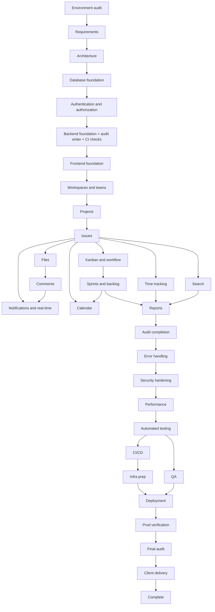

# 00 — Project Execution and Delivery Plan
> **Status:** Draft v1.0 · **Role:** Master execution roadmap, sits before `01-project-overview.md` · **Stack (as stated for the project):** Laravel 13, React, Inertia.js, Tailwind CSS, MySQL, Laravel Fortify, Laravel Wayfinder, PHPUnit, Laravel Boost, Git/GitHub, Redis and Docker where required.
> **Inspection note:** This plan was written after inspecting the documentation folder (`01`–`40`, `DOCUMENTATION-INDEX.md`, no renames found). **No application repository or code was available at writing time**, so nothing below claims that any feature is already implemented. Phase 0 must verify the real code state.

---

## 1. Purpose
This document controls **the order** in which the project is documented, built, tested, secured, deployed and delivered. It does not restate specifications: every detailed rule lives in documents `01`–`40`, which this plan references by filename. If this document and a specification appear to conflict about *sequence*, this document wins; about *behavior, schema or API*, the owning specification wins (see §2.6 and §3).

## 2. How to Use This Document
1. Start at **Phase 0** and move forward in order.
2. Complete every prerequisite before starting a phase. Never skip a dependency-critical phase (marked **⛔ gate**).
3. Read the listed documents *before* touching code for that phase; understand them, then plan.
4. A phase ends only when its **Completion criteria** pass and a **verification result** is recorded in `IMPLEMENTATION-STATUS.md` (created in Phase 0).
5. Existing documents are referenced, not duplicated. If implementation forces a change to a specification, update the owning document in the same phase.
6. Document ownership for conflicts: rules → `05-business-rules.md`; permissions → `36-api-security-and-permission-matrix.md`; schema → `08-database-design.md`; API → `11-api-documentation.md`; sequence → this file.

### 2.1 Known documentation-vs-stack discrepancies (resolve in Phase 1)
| # | Finding | Resolution (decision needed) | Owner doc |
|---|---|---|---|
| D1 | `29-testing-strategy.md` names **Pest**; project stack is **PHPUnit** | PHPUnit is authoritative; rewrite test tooling wording and dataset examples as PHPUnit data providers | 29, 30, 35 (T-044) |
| D2 | Docs describe Fortify sessions plus **Sanctum** tokens; Sanctum is not in the stated stack | Confirm whether the REST API/tokens ship in MVP. If yes, install Sanctum deliberately; if no, mark `11-api-documentation.md` token sections **[O]** | 11, 12 |
| D3 | **Passkeys** are required in this plan but absent from docs | Verify availability in the installed Laravel 13/Fortify/starter-kit version before promising; otherwise mark **[O]** and record the decision | 12, 26, 03 |
| D4 | **Wayfinder** (typed route/controller helpers) and **Boost** (AI-agent dev tooling) are absent from docs | Add to frontend/backend architecture and to the AI rules (§20) | 09, 10, 33 |
| D5 | UI spec: "one primary, dark mode [RC]" vs project requirement **dark theme + light-blue accent** | Dark theme is the default, light-blue accent is the primary token; light mode secondary | 13 |
| D6 | Email verification is **[RC]** in docs but required by this plan's deployment checks | Promote to **[R]** | 02, 12 |
| D7 | Real-time via Reverb, Redis, Docker are described as core | Treat as "where required": Phase 0 decides; Reverb only if real-time is kept in MVP | 06, 28, 32 |
| D8 | `34-development-roadmap.md` (10 phases) is coarser than this plan | 34/35 remain task-level references; crosswalk in §4.3 | 34, 35 |

## 3. Project Execution Philosophy
```
READ → UNDERSTAND → ANALYZE → PLAN → IMPLEMENT → TEST → REVIEW → FIX → VERIFY → DOCUMENT → NEXT PHASE
```
Code never starts blindly. Each phase begins by reading its documents and inspecting existing code, and ends with evidence (test output, checklist ticks). Testing is continuous: each module ships with its own tests in the same phase (§11). Security controls are built in dependency order, not bolted on at the end (§9, §12). Decisions that alter a specification are written back to the documentation.

---

# 4. COMPLETE PROJECT EXECUTION SEQUENCE

## 4.1 Sequence adjustments from the suggested list
| Adjustment | Reason |
|---|---|
| **File & Storage moved before Comments** (Phase 12 → before 13) | Issues and comments both carry attachments |
| **Audit writer + base exception handling + fast CI checks pulled into Phase 5**; audit UI/coverage completes in Phase 19 | Every later module must emit audit events from day one |
| **Notifications and real-time merged** (Phase 14) | Both consume the same domain events; earlier phases only *dispatch* events, listeners attach here |
| **Schema is designed up-front (Phase 3) but module tables migrate in their own phase** | Avoids dead tables; matches `08-database-design.md` while allowing feedback |

## 4.2 Phase overview
| Phase | Title | Gate |
|---|---|---|
| 0 | Project Discovery and Environment Audit | ⛔ |
| 1 | Requirements and Documentation Analysis | ⛔ |
| 2 | Architecture Finalization | ⛔ |
| 3 | Database and Data Model Foundation | ⛔ |
| 4 | Authentication and Authorization Foundation | ⛔ |
| 5 | Core Laravel Backend Foundation | ⛔ |
| 6 | React/Inertia Frontend Foundation | ⛔ |
| 7 | Workspace (Organization) and Team Management | |
| 8 | Project Management | |
| 9 | Issue / Ticket Management | ⛔ |
| 10 | Kanban and Workflow | |
| 11 | Sprint and Backlog Management | |
| 12 | File and Storage System | |
| 13 | Comments and Collaboration | |
| 14 | Notifications and Real-Time | |
| 15 | Time Tracking | |
| 16 | Calendar and Scheduling | |
| 17 | Search and Filtering | |
| 18 | Reports and Analytics | |
| 19 | Audit Logging (completion) | |
| 20 | Error Handling and Reliability | |
| 21 | Security Hardening | ⛔ |
| 22 | Performance Optimization | |
| 23 | Automated Testing Consolidation | ⛔ |
| 24 | QA and Full System Testing | ⛔ |
| 25 | CI/CD | ⛔ |
| 26 | Production Infrastructure Preparation | ⛔ |
| 27 | Production Deployment | ⛔ |
| 28 | Production Verification | ⛔ |
| 29 | Final Audit | ⛔ |
| 30 | Client Delivery and Documentation | |
| 31 | Project Completion | |

## 4.3 Crosswalk to existing roadmap
| This plan | `34-development-roadmap.md` phase | `35-project-task-breakdown.md` tasks |
|---|---|---|
| 0–2 | (prerequisite, not in 34) | – |
| 3–6 | 1 Foundation | T-001–T-009 |
| 7 | 2 Tenancy & RBAC | T-007–T-012 |
| 8–9 | 3 Projects & Issues | T-013–T-020 |
| 10–11 | 4 Boards, 6 Agile | T-021–T-023, T-028–T-031 |
| 12–14 | 5 Collaboration, 7 Real-time | T-024–T-027, T-032–T-033 |
| 15–18 | 8 Insight | T-034–T-038 |
| 19–22 | 9 Hardening | T-039–T-043 |
| 23–24 | 9 Hardening | T-044, T-047 |
| 25–31 | 10 Production | T-045, T-046, T-048 |

---

### PHASE 0 — Project Discovery and Environment Audit ⛔
- **Objective:** Learn the *real* state of repository, tooling and hosting before any decision.
- **Prerequisites:** Repository and documentation folder access.
- **Related documentation:** `DOCUMENTATION-INDEX.md`, `01-project-overview.md`, `32-devops-and-deployment.md`, `33-ci-cd-github-workflow.md`.
- **Tasks:** Inventory repo (installed Laravel version, starter kit, Fortify/Wayfinder/Boost/Inertia/Tailwind presence, existing migrations, routes, tests); confirm PHP, Composer, Node, MySQL, Redis, Docker availability; confirm hosting target and mail/storage providers; run the existing test suite and build; create `IMPLEMENTATION-STATUS.md`; record blockers and decisions.
- **Implementation order:** repo inventory → dependency/version check → local run (app boots, assets build, tests run) → hosting/provider facts → status document.
- **Expected output:** `IMPLEMENTATION-STATUS.md` (module status table, decision log, blocker log); environment audit notes.
- **Testing:** Existing suite runs; application boots; frontend builds.
- **Verification:** Audit lists installed vs. required packages; unknowns are logged as decisions.
- **Completion criteria:** Every stack item is marked *installed / missing / unknown*; local environment runs cleanly.
- **Dependencies:** All phases.

### PHASE 1 — Requirements and Documentation Analysis ⛔
- **Objective:** Understand and reconcile the documentation with the stack.
- **Prerequisites:** Phase 0.
- **Related documentation:** `01`, `02`, `03`, `04`, `05`, `36`, `39`, `40`.
- **Tasks:** Read all docs in §5 order; resolve discrepancies D1–D8 (§2.1); confirm MVP scope from `03-feature-requirements.md`; confirm open questions in `DOCUMENTATION-INDEX.md` §5 (billing, retention, SLA, custom roles); lock terminology (Workspace = Organization).
- **Implementation order:** foundation docs (01–05) → permission matrix (36) → checklist (40) → discrepancy fixes → decision log.
- **Expected output:** Updated docs for D1–D6; approved MVP scope list; decision log entries.
- **Testing:** Consistency review (terminology, roles, IDs cross-referenced).
- **Verification:** No document contradicts stack or another document on roles, rules or scope.
- **Completion criteria:** All D-items closed or explicitly deferred; MVP scope signed off.
- **Dependencies:** Phases 2–31 (scope and rules).

### PHASE 2 — Architecture Finalization ⛔
- **Objective:** Fix architecture decisions that are expensive to change later.
- **Prerequisites:** Phase 1.
- **Related documentation:** `06-system-architecture.md`, `07-multi-tenancy-architecture.md`, `09-laravel-backend-architecture.md`, `10-react-frontend-architecture.md`, `28-performance-and-scalability.md`, `37-data-flow-and-request-lifecycle.md`.
- **Tasks:** Confirm modular monolith, shared-schema tenancy with `workspace_id`, Inertia-first delivery with selective REST, whether real-time/Reverb, Redis, Meilisearch and Docker are in MVP; confirm repository/DTO usage only where justified; define module boundaries and namespace layout; define Wayfinder usage rules.
- **Implementation order:** tenancy decision → API/Inertia split → real-time/queue decision → module layout → conventions.
- **Expected output:** Architecture decisions recorded (ADR section in `06`); conventions list.
- **Testing:** Walk three flows (issue create, board move, invite) against the architecture on paper (`38-system-workflows.md`).
- **Verification:** Each flow maps to layers without gaps.
- **Completion criteria:** ADRs approved; tenancy strategy frozen.
- **Dependencies:** 3–6 directly; all later phases.

### PHASE 3 — Database and Data Model Foundation ⛔
- **Objective:** Establish the database and the foundation tables; finalize the full schema design.
- **Prerequisites:** Phase 2.
- **Related documentation:** `08-database-design.md`, `07-multi-tenancy-architecture.md`, `05-business-rules.md`, `28-performance-and-scalability.md`.
- **Tasks:** Create local/test databases; migrations, models, enums, factories and seeders for users, workspaces, roles/permissions, workspace members, invitations, sessions/queue/cache tables; add tenant trait/global scope skeleton; finalize remaining table designs (see §10).
- **Implementation order:** users → workspaces → roles/permissions/role_permission → workspace_members → invitations → tenant scope trait → seeders → schema review of later tables.
- **Expected output:** Foundation migrations run forward and back; seeded system roles and permission catalogue (`04`).
- **Testing:** Migration up/down; model relationship tests; unique/FK constraint tests; tenant-scope unit test.
- **Verification:** Schema matches `08`; indexes lead with `workspace_id` where required.
- **Completion criteria:** Fresh database builds from migrations and seeders; no unneeded tables.
- **Dependencies:** 4, 5 and every module phase.

### PHASE 4 — Authentication and Authorization Foundation ⛔
- **Objective:** Identity and access control before any protected module exists.
- **Prerequisites:** Phase 3.
- **Related documentation:** `12-authentication-and-authorization.md`, `04-user-roles-and-permissions.md`, `36-api-security-and-permission-matrix.md`, `26-security-requirements.md`, `07-multi-tenancy-architecture.md`.
- **Tasks:** Configure Fortify: registration, login, logout, email verification, password reset, password confirmation, 2FA; evaluate/implement passkeys per D3; login throttling; session settings; workspace-resolving middleware; `PermissionResolver`; base policies; role-aware middleware.
- **Implementation order:** Fortify features → email verification gate → throttling → 2FA → (passkeys if available) → workspace resolution middleware → permission resolver → policies skeleton → authorization dataset from `36`.
- **Expected output:** Working auth flows (backend); policy layer callable by later modules.
- **Testing:** PHPUnit feature tests for every auth flow; throttle test; authorization tests driven from the matrix (`36`); cross-tenant 404 test.
- **Verification:** Manual run of register → verify → login → 2FA → reset.
- **Completion criteria:** No business route is reachable unauthenticated; matrix tests pass for implemented permissions.
- **Dependencies:** 5–31 (all protected modules).

### PHASE 5 — Core Laravel Backend Foundation ⛔
- **Objective:** Shared backend plumbing every module reuses.
- **Prerequisites:** Phases 3–4.
- **Related documentation:** `09-laravel-backend-architecture.md`, `31-error-handling.md`, `25-audit-logging.md`, `37-data-flow-and-request-lifecycle.md`, `33-ci-cd-github-workflow.md`.
- **Tasks:** Folder conventions; service/action base patterns; domain exception classes and central handler; `AuditService` + audit event writer skeleton; queue and cache configuration (Redis where required); structured logging with request ID; API resource conventions; **fast CI checks** (lint, static analysis, PHPUnit) on pull requests; configure Boost for agent use.
- **Implementation order:** configuration → exception handler → logging → audit writer → queue/cache → service conventions → CI fast checks.
- **Expected output:** Working skeleton with one sample vertical slice proving controller → request → policy → service → event → listener.
- **Testing:** Handler mapping tests; audit write test; queue fake test.
- **Verification:** Slice runs end to end in tests and locally.
- **Completion criteria:** Conventions documented; CI green on the skeleton.
- **Dependencies:** 7–31.

### PHASE 6 — React/Inertia Frontend Foundation ⛔
- **Objective:** Application shell and design system.
- **Prerequisites:** Phases 4–5.
- **Related documentation:** `10-react-frontend-architecture.md`, `13-ui-ux-requirements.md`, `12-authentication-and-authorization.md`.
- **Tasks:** Tailwind design tokens (**dark theme default, light-blue accent**, light mode secondary); app layout (header, sidebar, workspace switcher); auth pages; shared props (user, workspace, permissions); Wayfinder helpers; core `ui/` components; toast, modal, form patterns; loading/empty/error patterns; responsive shell.
- **Implementation order:** tokens → layouts → auth pages → shared props/permission hook → base components → state patterns → responsive pass.
- **Expected output:** Authenticated shell with placeholder dashboard.
- **Testing:** Component tests where configured; manual keyboard and responsive check.
- **Verification:** Auth pages work against Phase 4 backend; permission hook hides/shows elements.
- **Completion criteria:** All base components exist and are reused (no ad-hoc duplicates).
- **Dependencies:** 7–31 (all UI).

### PHASE 7 — Workspace (Organization) and Team Management
- **Objective:** Multi-tenant administration.
- **Prerequisites:** Phases 4–6.
- **Related documentation:** `18-team-and-organization-management.md`, `07-multi-tenancy-architecture.md`, `04`, `05` (BR-ORG), `36`.
- **Tasks:** Workspace create/settings/switch/delete rules; invitations (send, accept, revoke, expire); member role management; teams CRUD and membership; last-owner protection.
- **Implementation order:** workspace service → invitations → member management → teams → UI in same order.
- **Expected output:** Full workspace/team UI and backend.
- **Testing:** Invitation edge cases; role-change and last-owner tests; tenant isolation tests for every model.
- **Verification:** Two workspaces cannot see each other's data by ID, route or search.
- **Completion criteria:** BR-ORG rules covered by tests.
- **Dependencies:** 8–31.

### PHASE 8 — Project Management
- **Objective:** Projects with members, roles and workflow seeds.
- **Prerequisites:** Phase 7.
- **Related documentation:** `14-project-management-module.md`, `05` (BR-PRJ), `16-kanban-and-workflow.md` (workflow seeding), `36`.
- **Tasks:** Project create (unique key, lead, template), settings, members and project roles, visibility, archive, project dashboard shell, seeded default workflow.
- **Implementation order:** migrations (projects, project_members, workflows, statuses, transitions) → service → policies → controllers → UI.
- **Expected output:** Project CRUD and settings working.
- **Testing:** Key uniqueness, archive rules, project-role override tests.
- **Verification:** Matrix rows for Project/Workflow verified.
- **Completion criteria:** BR-PRJ covered; archived project is read-only.
- **Dependencies:** 9–18.

### PHASE 9 — Issue / Ticket Management ⛔
- **Objective:** The core domain object.
- **Prerequisites:** Phase 8.
- **Related documentation:** `15-issue-management-module.md`, `05` (BR-ISS, BR-WFL), `08`, `36`, `38-system-workflows.md`.
- **Tasks:** Issue migrations and indexes; sequential key allocation with row lock; create/update (optimistic version)/delete/restore; types, priority, labels, subtasks, assignment; issue detail UI; events dispatched (listeners attach in Phases 14 and 19).
- **Implementation order:** migrations → key allocation → service → policy → API/Inertia → list/detail UI → subtasks/labels → events.
- **Expected output:** Working issue lifecycle.
- **Testing:** Concurrent key test, 409 conflict test, subtask rule, assignee-must-be-member.
- **Verification:** Create → assign → edit → delete/restore manually and in tests.
- **Completion criteria:** BR-ISS covered; no duplicate keys under concurrency.
- **Dependencies:** 10–18.

### PHASE 10 — Kanban and Workflow
- **Objective:** Visual workflow execution.
- **Prerequisites:** Phase 9.
- **Related documentation:** `16-kanban-and-workflow.md`, `05` (BR-WFL), `15`, `10`.
- **Tasks:** Transition engine with required fields; ranking service; board endpoint and UI with drag-and-drop and keyboard alternative; WIP limits; filters; workflow settings UI.
- **Implementation order:** transition engine → ranking → board API → board UI → WIP → filters.
- **Expected output:** Working board.
- **Testing:** Invalid transition, WIP, ranking stability, revert-on-failure UI test.
- **Verification:** Browser test of drag across columns.
- **Completion criteria:** All BR-WFL rules enforced server-side.
- **Dependencies:** 11, 14, 18.

### PHASE 11 — Sprint and Backlog Management
- **Objective:** Agile planning.
- **Prerequisites:** Phase 10.
- **Related documentation:** `17-sprint-and-backlog-management.md`, `05` (BR-SPR), `23`, `36`.
- **Tasks:** Backlog ranking and bulk edit; sprints (create, start with snapshot, complete with carry-over); epics and progress; scope-change logging; nightly snapshot job.
- **Implementation order:** backlog → sprint service and state rules → planner UI → epics → snapshot scheduler.
- **Expected output:** Full sprint cycle.
- **Testing:** State machine, one-active-sprint, date overlap, carry-over tests.
- **Verification:** Run a full sprint in seeded data.
- **Completion criteria:** BR-SPR covered.
- **Dependencies:** 18 (reports).

### PHASE 12 — File and Storage System
- **Objective:** Secure uploads used by issues and comments.
- **Prerequisites:** Phase 9.
- **Related documentation:** `27-file-and-storage-system.md`, `26`, `05` (BR-FIL).
- **Tasks:** Private storage config; upload validation (extension + detected MIME, 25 MB); random names; signed downloads; scan job (scanner per D-decision); cleanup jobs; avatars.
- **Implementation order:** storage disks → validation → upload flow → signed download → scan → cleanup.
- **Expected output:** Secure attachment service.
- **Testing:** Oversize, blocked type, spoofed MIME, cross-tenant download, scan states.
- **Verification:** Downloads only via policy-checked signed URL.
- **Completion criteria:** No public path to private files.
- **Dependencies:** 13, 21.

### PHASE 13 — Comments and Collaboration
- **Objective:** Discussion around issues.
- **Prerequisites:** Phases 9, 12.
- **Related documentation:** `20-comments-and-collaboration.md`, `05`, `36`, `26` (XSS).
- **Tasks:** Threaded comments; sanitization; mentions parsing; edit/delete rules; attachments in issue/comment UI; activity feed component.
- **Implementation order:** comment service → sanitizer → mentions → UI → attachments → feed.
- **Expected output:** Working comments with mentions.
- **Testing:** XSS payloads, non-member mention ignored, delete permissions.
- **Verification:** Matrix rows for Comment verified.
- **Completion criteria:** Sanitization proven by tests.
- **Dependencies:** 14.

### PHASE 14 — Notifications and Real-Time
- **Objective:** Deliver events to users.
- **Prerequisites:** Phases 9, 13 (events exist); queue configured (Phase 5).
- **Related documentation:** `19-notification-system.md`, `37`, `06`, `28`, `32` (workers).
- **Tasks:** Listeners for assignment, mentions, transitions, sprint events; preferences; dedupe; in-app UI (bell); email; queue workers; if kept in MVP, Reverb private channels, Echo hooks, presence.
- **Implementation order:** listeners → preferences → dedupe → mail → in-app UI → real-time channels → live board/comment updates.
- **Expected output:** Notifications end to end; live updates if enabled.
- **Testing:** Fake queue/mail; dedupe; channel authorization; two-browser check.
- **Verification:** Mention a user → notification appears (and email queued).
- **Completion criteria:** BR-NTF covered; failures retry and are visible.
- **Dependencies:** 20, 26, 28.

### PHASE 15 — Time Tracking
- **Objective:** Log and review time.
- **Prerequisites:** Phase 9.
- **Related documentation:** `21-time-tracking.md`, `05` (BR-TIM), `36`.
- **Tasks:** Timers, manual entries, timesheet, stale-timer job, permissions (`time.log`, `time.view_all`).
- **Implementation order:** migrations → service → scheduler job → UI.
- **Expected output:** Timer and timesheet.
- **Testing:** One-timer rule, overlap, auto-stop, viewer denial.
- **Verification:** Log time and see it in a report preview.
- **Completion criteria:** BR-TIM covered.
- **Dependencies:** 18.

### PHASE 16 — Calendar and Scheduling
- **Objective:** Date-based views.
- **Prerequisites:** Phases 9, 11.
- **Related documentation:** `22-calendar-and-scheduling.md`.
- **Tasks:** Calendar views; iCal feed with revocable token; policy-filtered items.
- **Implementation order:** data endpoint → views → iCal.
- **Expected output:** Calendar and feed.
- **Testing:** Policy filtering, token revocation.
- **Verification:** Feed opens in a calendar client.
- **Completion criteria:** No item visible that the user cannot view.
- **Dependencies:** none critical.

### PHASE 17 — Search and Filtering
- **Objective:** Find work quickly.
- **Prerequisites:** Phase 9.
- **Related documentation:** `24-search-and-filtering.md`, `08` (FULLTEXT), `28`.
- **Tasks:** FULLTEXT search behind an interface; filters, sorting, cursor pagination; saved filters; global search UI.
- **Implementation order:** search interface → filters → pagination → saved filters → UI.
- **Expected output:** Working search and filters.
- **Testing:** Tenant/policy filtering, short-word fallback, special characters.
- **Verification:** Query plans use indexes.
- **Completion criteria:** No cross-tenant or unauthorized results.
- **Dependencies:** 22.

### PHASE 18 — Reports and Analytics
- **Objective:** Progress insight.
- **Prerequisites:** Phases 11, 15, 17.
- **Related documentation:** `23-reports-and-analytics.md`, `28`.
- **Tasks:** Dashboard widgets; burndown, velocity, workload, time reports; caching; CSV export (queued if large).
- **Implementation order:** aggregates → snapshots use → widgets → reports → export.
- **Expected output:** Dashboard and reports.
- **Testing:** Values checked against manual calculation on seeded data.
- **Verification:** Report totals reconcile with board/time data.
- **Completion criteria:** Matrix rows for Reports verified.
- **Dependencies:** 22, 24.

### PHASE 19 — Audit Logging (completion)
- **Objective:** Full, immutable audit coverage.
- **Prerequisites:** Phases 5–18.
- **Related documentation:** `25-audit-logging.md`, `26`, `36`.
- **Tasks:** Ensure every trackable action emits an event; security events; admin viewer, filters, export; retention job; immutability guard.
- **Implementation order:** coverage gap review → missing listeners → viewer → export → retention.
- **Expected output:** Audit viewer and coverage report.
- **Testing:** One test per action category; immutability test.
- **Verification:** Perform each action; matching log row exists.
- **Completion criteria:** Coverage list in `25` fully ticked.
- **Dependencies:** 21, 24.

### PHASE 20 — Error Handling and Reliability
- **Objective:** Predictable failure behavior.
- **Prerequisites:** Phases 5–19.
- **Related documentation:** `31-error-handling.md`.
- **Tasks:** Verify handler mappings; error pages; frontend boundaries; job retry/failure paths; reconnect behavior; user-facing messages.
- **Implementation order:** backend mapping → frontend states → job failures → real-time reconnect.
- **Expected output:** Consistent error UX.
- **Testing:** Force each error class.
- **Verification:** No stack trace or SQL visible with debug off.
- **Completion criteria:** Table in `31` verified.
- **Dependencies:** 21, 24.

### PHASE 21 — Security Hardening ⛔
- **Objective:** Verify and close security gaps (see §12).
- **Prerequisites:** Phases 4–20.
- **Related documentation:** `26-security-requirements.md`, `36`, `07`, `12`, `27`.
- **Tasks:** Run through §12 sequence; dependency audit; headers; rate limits; secrets scan; threat-model walk-through.
- **Implementation order:** per §12.
- **Expected output:** Security verification report.
- **Testing:** Security tests (§11 item 11), cross-tenant suite.
- **Verification:** Checklist in `26` ticked with evidence.
- **Completion criteria:** No open critical/high finding.
- **Dependencies:** 23–31.

### PHASE 22 — Performance Optimization
- **Objective:** Meet budgets in `02` (NFR-01/02) and `28`.
- **Prerequisites:** Phases 9–19 (real queries exist).
- **Related documentation:** `28-performance-and-scalability.md`, `08`.
- **Tasks:** N+1 detection; index review with EXPLAIN; caching; queue tuning; frontend bundle and list virtualization.
- **Implementation order:** measure → fix worst queries → cache → frontend → re-measure.
- **Expected output:** Before/after measurements.
- **Testing:** Performance tests (§11 item 12).
- **Verification:** Budgets met on seeded large data.
- **Completion criteria:** Documented results.
- **Dependencies:** 24, 27.

### PHASE 23 — Automated Testing Consolidation ⛔
- **Objective:** Close gaps in the automated suite.
- **Prerequisites:** Phases 4–22.
- **Related documentation:** `29-testing-strategy.md` (after D1 fix), `36`, `30`.
- **Tasks:** Coverage report; add missing PHPUnit tests; authorization matrix suite; tenant isolation suite; frontend/browser tests if configured.
- **Implementation order:** coverage gaps → authz/tenant suites → integration → browser.
- **Expected output:** Passing suite with coverage report.
- **Testing:** Entire suite in CI.
- **Verification:** Coverage target from `29` reached or gap documented.
- **Completion criteria:** All tests green, no skipped critical tests.
- **Dependencies:** 24, 25.

### PHASE 24 — QA and Full System Testing ⛔
- **Objective:** Human and exploratory verification.
- **Prerequisites:** Phase 23.
- **Related documentation:** `30-qa-test-plan.md`, `40-final-feature-checklist.md`, `13`.
- **Tasks:** Execute QA scenarios; browser and responsive matrix; accessibility checks; regression run; defect triage and fixes.
- **Implementation order:** smoke → scenarios by module → cross-role → regression.
- **Expected output:** QA report and defect log.
- **Testing:** As in `30`.
- **Verification:** All P0/P1 scenarios pass.
- **Completion criteria:** No open P0/P1 defects.
- **Dependencies:** 25–31.

### PHASE 25 — CI/CD ⛔
- **Objective:** Automated, repeatable delivery (see §13).
- **Prerequisites:** Phase 23; Phase 5 fast checks exist.
- **Related documentation:** `33-ci-cd-github-workflow.md`, `32`.
- **Tasks:** Complete pipeline (lint, static analysis, tests, build, audit, artifact); branch protection; staging deploy job; production approval gate.
- **Implementation order:** PR checks → build artifact → staging deploy → production job with approval.
- **Expected output:** Working pipelines.
- **Testing:** Pipeline run on a test PR; deliberate failure blocks merge.
- **Verification:** Green run produces deployable artifact.
- **Completion criteria:** Merges blocked without green checks.
- **Dependencies:** 26–28.

### PHASE 26 — Production Infrastructure Preparation ⛔
- **Objective:** Ready the environment (see §14 server preparation).
- **Prerequisites:** Phase 25; hosting decision from Phase 0.
- **Related documentation:** `32-devops-and-deployment.md`, `26`, `27`, `28`.
- **Tasks:** Provision server/provider; runtime versions; database and least-privilege user; Redis if required; storage; mail; TLS; process manager for queue/scheduler; monitoring and backups configured.
- **Implementation order:** server → runtimes → database → storage → web server/TLS → workers → monitoring → backups.
- **Expected output:** Environment ready, secrets stored outside Git.
- **Testing:** Infrastructure smoke checks; backup and restore rehearsal.
- **Verification:** Restore drill succeeds.
- **Completion criteria:** All §14 preparation items ticked.
- **Dependencies:** 27, 28.

### PHASE 27 — Production Deployment ⛔
- **Objective:** Release to production per §14 and §16.
- **Prerequisites:** Phases 24, 26 and release gate (§16) satisfied.
- **Related documentation:** `32`, `33`, `34`.
- **Tasks:** Staging rehearsal; production deploy; migrations; cache warm; start workers; announce window.
- **Implementation order:** staging dress rehearsal → tag release → deploy → migrate → verify services.
- **Expected output:** Live application.
- **Testing:** Immediate smoke test.
- **Verification:** Health checks green.
- **Completion criteria:** Deployment finished without rollback.
- **Dependencies:** 28.

### PHASE 28 — Production Verification ⛔
- **Objective:** Prove production works (checklist §15).
- **Prerequisites:** Phase 27.
- **Related documentation:** `40`, `30`, `38`.
- **Tasks:** Execute §15 checklist with real (test) accounts; monitor logs and queues for a defined window.
- **Implementation order:** availability → auth → isolation → modules → background jobs → monitoring.
- **Expected output:** Signed verification record.
- **Testing:** Production smoke tests.
- **Verification:** All §15 items pass; otherwise trigger §17.
- **Completion criteria:** No critical console or server errors.
- **Dependencies:** 29.

### PHASE 29 — Final Audit ⛔
- **Objective:** Independent completeness review.
- **Prerequisites:** Phase 28.
- **Related documentation:** `40`, `DOCUMENTATION-INDEX.md`, `26`, `29`, `30`.
- **Tasks:** Reconcile `40-final-feature-checklist.md` against evidence; confirm docs match implementation; confirm no secret exposure; confirm backup/rollback/monitoring exist.
- **Implementation order:** checklist → docs sync → security/ops evidence → sign-off.
- **Expected output:** Audit report.
- **Testing:** Spot re-tests of random checklist items.
- **Verification:** Every checklist item has evidence.
- **Completion criteria:** §16 gate satisfied.
- **Dependencies:** 30, 31.

### PHASE 30 — Client Delivery and Documentation
- **Objective:** Hand over.
- **Prerequisites:** Phase 29.
- **Related documentation:** `39-client-documentation.md`, `40`.
- **Tasks:** Finalize client document to match real features; demo data/accounts; admin handover notes; support and maintenance notes.
- **Implementation order:** client doc → demo → handover session → acceptance.
- **Expected output:** Client pack and acceptance record.
- **Testing:** Client walk-through.
- **Verification:** Client verifies checklist items.
- **Completion criteria:** Client sign-off.
- **Dependencies:** 31.

### PHASE 31 — Project Completion
- **Objective:** Close the project.
- **Prerequisites:** Phase 30.
- **Related documentation:** `DOCUMENTATION-INDEX.md`, this file.
- **Tasks:** Final status update; archive documentation version; tag release; retrospective; backlog of future improvements.
- **Implementation order:** status → archive → retrospective.
- **Expected output:** Closed project record.
- **Testing:** n/a.
- **Verification:** §19 checklist fully ticked.
- **Completion criteria:** Project declared complete.
- **Dependencies:** none.

---

# 5. DOCUMENTATION DEPENDENCY MAP
"Must read before" refers to the phase in §4. Filenames are the actual files found in the folder.

| Document | Must Read Before | Purpose | Depends On |
|---|---|---|---|
| `00-PROJECT-EXECUTION-AND-DELIVERY-PLAN.md` | Everything | Execution order and gates | – |
| `DOCUMENTATION-INDEX.md` | Phase 1 | Index, reading order, open questions | 00 |
| `01-project-overview.md` | Phase 1 | Vision, scope, conventions, assumptions A1–A8 | – |
| `02-srs.md` | Phase 1 | Requirements and acceptance criteria | 01 |
| `03-feature-requirements.md` | Phase 1 | Feature list, MVP vs advanced | 01, 02 |
| `04-user-roles-and-permissions.md` | Phase 1, 4 | Roles and permission catalogue | 01, 02 |
| `05-business-rules.md` | Phase 1, each module | Rules `BR-*` | 02, 04 |
| `06-system-architecture.md` | Phase 2 | Architecture, ADRs | 01, 02 |
| `07-multi-tenancy-architecture.md` | Phase 2, 3, 7 | Tenant isolation | 04, 06, 08 |
| `08-database-design.md` | Phase 3 | Schema and ERD | 05, 07 |
| `09-laravel-backend-architecture.md` | Phase 5 | Backend structure and layers | 06–08 |
| `10-react-frontend-architecture.md` | Phase 6 | Frontend structure | 06, 11 |
| `11-api-documentation.md` | Phase 5 (API decisions), module phases | REST API contract | 08, 09, 12 |
| `12-authentication-and-authorization.md` | Phase 4 | Auth flows | 04, 05, 07 |
| `13-ui-ux-requirements.md` | Phase 6 | Design and UX rules | 03, 10 |
| `14-project-management-module.md` | Phase 8 | Projects | 04, 05, 08 |
| `15-issue-management-module.md` | Phase 9 | Issues | 05, 08, 14 |
| `16-kanban-and-workflow.md` | Phase 8 (seed), 10 | Board and workflow | 05, 15 |
| `17-sprint-and-backlog-management.md` | Phase 11 | Sprints, backlog, epics | 05, 15, 16 |
| `18-team-and-organization-management.md` | Phase 7 | Workspace, teams, invitations | 04, 07 |
| `19-notification-system.md` | Phase 14 | Notifications | 05, 09 |
| `20-comments-and-collaboration.md` | Phase 13 | Comments, mentions | 15, 19, 27 |
| `21-time-tracking.md` | Phase 15 | Time tracking | 05, 15 |
| `22-calendar-and-scheduling.md` | Phase 16 | Calendar | 15, 17 |
| `23-reports-and-analytics.md` | Phase 11, 18 | Reports | 08, 17, 21 |
| `24-search-and-filtering.md` | Phase 17 | Search | 08, 15 |
| `25-audit-logging.md` | Phase 5, 19 | Audit log | 05, 08 |
| `26-security-requirements.md` | Phase 4, 21 | Security requirements | 07, 12, 25 |
| `27-file-and-storage-system.md` | Phase 12 | Files | 05, 26 |
| `28-performance-and-scalability.md` | Phase 2, 22 | Performance | 06, 08 |
| `29-testing-strategy.md` | Phase 1 (fix D1), 23 | Testing | 02, 09, 10 |
| `30-qa-test-plan.md` | Phase 24 | QA plan | 29, 36, 40 |
| `31-error-handling.md` | Phase 5, 20 | Errors and logging | 09, 11 |
| `32-devops-and-deployment.md` | Phase 0, 26 | Environments, Docker, deploy | 06, 28 |
| `33-ci-cd-github-workflow.md` | Phase 5, 25 | Git and CI/CD | 29, 32 |
| `34-development-roadmap.md` | Phase 1 | Coarse phases (see §4.3) | 03 |
| `35-project-task-breakdown.md` | Each phase | Task IDs T-001–T-048 | 03, 34 |
| `36-api-security-and-permission-matrix.md` | Phase 1, 4, 23 | Role × action matrix | 04, 11, 26 |
| `37-data-flow-and-request-lifecycle.md` | Phase 2, 5 | Request and background flows | 06, 09–11 |
| `38-system-workflows.md` | Phase 2, 24 | End-to-end workflows | 05, 12, 15–19 |
| `39-client-documentation.md` | Phase 30 | Client-facing overview | 01 |
| `40-final-feature-checklist.md` | Phase 24, 28, 29 | Final verification | 02, 03, 36 |

# 6. DEVELOPMENT DEPENDENCY MAP

Independent branches (may run in parallel after their prerequisites): 12→13, 14, 15, 16, 17.

# 7. BACKEND IMPLEMENTATION ORDER
Applies inside every module; foundation items happen once in Phases 3–5. Reference: `09-laravel-backend-architecture.md`.

| Step | Item | Why here | Depends on |
|---|---|---|---|
| 1 | Configuration and environment (`.env`, config, Redis/queue where required) | Everything reads config | Phase 0 |
| 2 | Migrations (module tables, indexes, FKs) | Models need tables | Design in `08` |
| 3 | Enums | Models, requests and resources share them | 2 |
| 4 | Models, relationships, casts, tenant trait | Services query through models | 2, 3 |
| 5 | Factories and seeders | Tests and demo data | 4 |
| 6 | Permissions/roles additions (catalogue in `04`) | Policies need permission keys | 4 |
| 7 | Policies | Authorization before controllers exist | 6 |
| 8 | Middleware (tenant, project access, throttling) | Route protection | 6, 7 |
| 9 | Form Requests (validation) | Controllers depend on them | 3, 7 |
| 10 | DTOs — only where a request feeds many fields into a service | Avoid needless layers | 9 |
| 11 | Services / Actions (business rules `BR-*`, transactions) | Core logic | 4, 7 |
| 12 | Repositories — only for search/reporting (`09`) | Complex queries only | 11 |
| 13 | Events | Decouple side effects | 11 |
| 14 | Controllers and routes (Inertia; REST only where `11` requires) | Thin layer over services | 7–11 |
| 15 | API resources / Inertia props shaping | Stable output | 14 |
| 16 | Listeners (audit first, notifications in Phase 14) | React to events | 13 |
| 17 | Notification classes and jobs | Async delivery | 16 |
| 18 | Queues and scheduled tasks | Snapshots, cleanup, digests | 17 |
| 19 | Logging and audit entries | Traceability | 5 |
| 20 | Tests (PHPUnit) per module | Written with steps 7–18, not after | all |

# 8. FRONTEND IMPLEMENTATION ORDER
Reference: `10-react-frontend-architecture.md`, `13-ui-ux-requirements.md`. Global rules: **dark theme (default), light-blue accent, responsive, Jira-like professional density, reusable components, consistent UX.** Use Wayfinder helpers for routes; no hard-coded URLs.

| Order | Item | Phase | Notes |
|---|---|---|---|
| 1 | Design tokens and base components | 6 | Dark palette, light-blue accent, focus rings |
| 2 | Application layout (header, sidebar, workspace switcher) | 6 | Collapses to drawer on mobile |
| 3 | Authentication pages (login, register, verify, reset, confirm password, 2FA, passkeys if D3 allows) | 6 | After Phase 4 backend |
| 4 | Navigation and permission-based UI hook | 6 | Hide/disable by permission; server remains authoritative |
| 5 | Dashboard shell | 6 → 18 | Widgets arrive with data |
| 6 | Organization (workspace) and team UI | 7 | – |
| 7 | Project UI | 8 | – |
| 8 | Issue/ticket UI (list, form, detail) | 9 | Inline edit with optimistic update |
| 9 | Kanban board | 10 | Keyboard alternative to drag |
| 10 | Sprint/backlog UI | 11 | – |
| 11 | Attachments UI, then comments | 12–13 | – |
| 12 | Notifications UI (+ real-time hooks) | 14 | – |
| 13 | Time tracking UI | 15 | – |
| 14 | Calendar | 16 | – |
| 15 | Search and filtering | 17 | Debounced, saved filters |
| 16 | Reports | 18 | – |
| 17 | Settings (profile, security, notifications, workspace) | with 4, 7, 14 | – |
| 18 | Loading, empty and error states | every phase, audited in 20 | Skeletons, `EmptyState`, error boundaries |
| 19 | Responsive pass | every phase, audited in 24 | 360/768/1024 widths |
| 20 | Accessibility | every phase, audited in 24 | Keyboard, ARIA, contrast ≥ 4.5:1 |

# 9. AUTHENTICATION AND SECURITY ORDER
Authentication and authorization are built **before** any protected business module (Phase 4 precedes Phases 7–18).

| Order | Item | Phase | Notes |
|---|---|---|---|
| 1 | Registration, login, logout | 4 | Fortify |
| 2 | Email verification | 4 | Required (D6); gate workspace creation |
| 3 | Password reset, password confirmation | 4 | Signed, expiring, single-use |
| 4 | Session management | 4 | Secure settings, session list/revoke |
| 5 | Two-factor authentication | 4 | TOTP + recovery codes |
| 6 | Passkeys | 4 (if available) | Confirm support first (D3); never advertise until working |
| 7 | Roles, permissions, permission resolver | 3–4 | Catalogue in `04` |
| 8 | Policies and middleware | 4, extended per module | Deny by default |
| 9 | Organization/tenant isolation | 3–4, proven in 7 | Global scope, membership middleware, 404 for outsiders |
| 10 | Rate limiting | 4 (auth), 21 (all) | Values from `36` |
| 11 | CSRF | Framework default, verified 21 | Inertia handles tokens |
| 12 | Input validation | Every module | Form Requests |
| 13 | File upload security | 12 | Per `27` |
| 14 | Audit logging | 5 (writer), 19 (full) | Security events included |

# 10. DATABASE IMPLEMENTATION ORDER
Reference: `08-database-design.md`. Create only tables the documents define.

| Order | Tables | Phase | Key integrity points |
|---|---|---|---|
| 1 | Database creation (dev, test) | 3 | utf8mb4, InnoDB |
| 2 | `users`, sessions, password/verification support | 3 | Unique email; soft delete |
| 3 | `workspaces`, `workspace_members` | 3 | Unique slug; unique (workspace, user) |
| 4 | `roles`, `permissions`, `role_permission` | 3 | System roles seeded |
| 5 | `invitations`, `teams`, `team_user` | 7 | Unique token; unique team name per workspace |
| 6 | `projects`, `project_members` | 8 | Unique (workspace, key); counter column |
| 7 | `workflows`, `workflow_statuses` (statuses), `workflow_transitions` | 8 | Status FK restricts delete while in use |
| 8 | `issues`, `labels`, `issue_label`, priorities (enum, not a table) | 9 | Unique (project, number); composite indexes; FULLTEXT; soft delete |
| 9 | `sprints`, `report_snapshots` | 11 | Unique (sprint, date) |
| 10 | `attachments` | 12 | Scan status column |
| 11 | `comments`, `mentions` | 13 | Self-referencing parent |
| 12 | `notifications`, `notification_preferences` | 14 | Index (user, read state) |
| 13 | `time_entries` | 15 | Index (user, start) |
| 14 | Calendar data | 16 | **No new tables**: derived from due dates and sprints |
| 15 | `saved_filters` | 17 | – |
| 16 | `activity_logs` | 5 (table), 19 (partition, retention) | Append-only, no updates/deletes |
| 17 | `issue_links` | 9 or later | **[RC]**: only if approved in Phase 1 |

Cascade rules: tenant-owned rows restrict deletion of parents that still have children, and use soft deletes (users, workspaces, projects, issues, comments, attachments) with scheduled purge; pivot rows cascade; audit rows never cascade. Every tenant table carries `workspace_id` with an index leading with it. Every migration must be reversible and tested.

# 11. TESTING STRATEGY ORDER
Testing is continuous. Reference: `29-testing-strategy.md`, `30-qa-test-plan.md`. Framework: **PHPUnit**.

| # | Layer | When it starts | Where it is required |
|---|---|---|---|
| 1 | Developer-level checks (lint, static analysis, build) | Phase 5, every commit | CI fast checks |
| 2 | Unit tests | From Phase 3 | Services, enums, resolver, ranking |
| 3 | Feature tests | From Phase 4 | Every route and form |
| 4 | Integration tests | From Phase 9 | Event → listener → job chains |
| 5 | Authentication tests | Phase 4 | All flows and throttling |
| 6 | Authorization tests | Phase 4, extended per module | Driven by `36` matrix |
| 7 | API tests | When a REST endpoint exists | Contract and errors per `11` |
| 8 | Database tests | Phase 3 | Migrations, constraints, tenant scope |
| 9 | Frontend tests | Phase 6, if configured | Critical components/forms |
| 10 | Browser/E2E | From Phase 10, if configured | Board, sprint, invite flows |
| 11 | Security tests | Phase 4 basics, Phase 21 full | IDOR, XSS, upload abuse |
| 12 | Performance tests | Phase 22 | Budgets from `02`/`28` |
| 13 | Regression | Every release candidate | Full automated suite |
| 14 | Full QA | Phase 24 | `30` scenarios |
| 15 | Production smoke | Phase 28 | §15 checklist |

# 12. SECURITY HARDENING ORDER
Executed in Phase 21; each item must be **implemented and evidenced** before being claimed. Reference: `26-security-requirements.md`.

| Order | Control | Evidence required |
|---|---|---|
| 1 | Authentication (throttle, verification, reset) | Auth test suite |
| 2 | Authorization | Matrix tests all pass |
| 3 | Tenant isolation | Cross-tenant suite (web, API, uploads, search, channels) |
| 4 | Input validation | Every write route has a Form Request |
| 5 | SQL injection prevention | No unparameterized raw SQL (code search + review) |
| 6 | XSS prevention | Sanitizer tests, escaped output, CSP in place |
| 7 | CSRF | State-changing routes protected |
| 8 | Mass assignment | No unguarded models or `all()` passed to models |
| 9 | Session and password security | Cookie flags, hashing, reset invalidates sessions |
| 10 | Two-factor and passkeys | Working flows (passkeys only if implemented) |
| 11 | Rate limiting | Tests for login, reset, invite, upload, search |
| 12 | File upload security | Abuse tests from `27` |
| 13 | Sensitive data and secrets | Secret scan clean; encrypted fields verified |
| 14 | Logging and audit trails | No secrets in logs; security events present |
| 15 | Production configuration | Debug off, correct APP_ENV, HTTPS enforced |
| 16 | Secure cookies and security headers | Header scan output |
| 17 | Dependency auditing | `composer` and `npm` audit results reviewed |

# 13. CI/CD ORDER
```
Local development → Git branch → Commit → Pull Request → Automated checks → Tests → Build → Review → Merge → Deployment pipeline → Production deployment → Smoke test → Monitoring
```
System: **GitHub Actions** (per `33-ci-cd-github-workflow.md`); confirm in Phase 0.
1. **Local:** run lint, static analysis and tests before committing.
2. **Branch/commit:** `feature/…`, Conventional Commits.
3. **PR:** template, linked task ID (T-###), migration and security notes.
4. **Automated checks:** lint, static analysis, PHPUnit, frontend build (and frontend/browser tests if configured), dependency and secret scans.
5. **Review:** required approval; CODEOWNERS for policies, migrations, auth.
6. **Merge:** squash into protected `main` only when green.
7. **Pipeline:** build artifact/image → staging deploy → staging smoke test → manual approval → production deploy (Phases 25–27).
8. **Post-deploy:** smoke test and monitoring window (Phase 28).

# 14. DEPLOYMENT ORDER
Hosting provider and OS are **not yet known**; commands and file paths are intentionally omitted until Phase 0 records the target. Reference: `32-devops-and-deployment.md`.

### 14.1 Server preparation
Provider and sizing decision · supported OS · PHP version required by installed Laravel 13 · Composer · Node.js and npm (build only if assets are built on the server) · MySQL (managed if possible) · Redis if queues/cache/sessions/real-time require it · web server · process manager keeping queue workers (and Reverb if used) running · scheduler entry that triggers Laravel's scheduler every minute.

### 14.2 Application preparation
1. Obtain the release (tag or build artifact) from GitHub.
2. Install PHP dependencies without dev packages.
3. Install frontend dependencies and build production assets (or ship prebuilt assets).
4. Configure environment file from the documented variable list (§14.5).
5. Generate the application key once and store it securely; never regenerate on a live system.
6. Configure the database connection.
7. Run migrations (backward-compatible; take a backup first).
8. Configure storage (§14.7) and mail.
9. Cache configuration, routes and views.
10. Start queue workers and register the scheduler.

### 14.3 Web server
Document root must be Laravel's `public` directory only. Deny access to dotfiles, `.env`, `storage`, `vendor` and source folders. Route all requests through the front controller; long cache headers for hashed assets; correct proxy headers if behind a load balancer.

### 14.4 HTTPS
Valid TLS certificate with automated renewal; redirect HTTP to HTTPS; HSTS after verification; secure session cookies; application URL configured as HTTPS.

### 14.5 Environment variables and secrets
Categories: application (env, debug off, URL, key) · database · cache/queue/session driver · Redis · mail · storage · real-time (if used) · error monitoring (if configured) · rate-limit and feature flags. Secrets live in the server or secret manager, are never committed, and are rotated if ever exposed. Maintain a documented `.env.example` without real values.

### 14.6 Database
Separate production database; least-privilege application user (no schema-admin rights at runtime; a separate migration user or step); credentials in secrets only; automated backups before each migration; restore rehearsal completed in Phase 26.

### 14.7 Storage
Private disk for attachments (never web-served directly); public disk only for non-sensitive assets, if any, with the required storage link configured; signed download URLs; object storage if selected in Phase 0; storage included in backups.

### 14.8 Queue and scheduler
A supervised worker process for each queue defined in `28`; restart workers on every deploy; failed-job table monitored and alerted; scheduler runs every minute and executes: sprint snapshots, stale-timer cleanup, purges, digests.

### 14.9 Monitoring
Application logs (structured, request ID) · web/server logs · queue failures and depth · database health and slow queries · disk space · CPU/RAM · uptime check · error monitoring if configured (Sentry per `31`). Alerts to a named owner.

### 14.10 Backup and recovery
Database: daily backups plus point-in-time recovery if the provider supports it. Files: backed up or versioned in object storage. Retention: defined in Phase 26 (proposal: 30 days daily, 12 months monthly). Recovery procedure written, and **restore tested before go-live**.

# 15. DEPLOYMENT VERIFICATION CHECKLIST
Run with dedicated test accounts (Owner, Admin, PM, Developer, Viewer) in two workspaces.
- [ ] Website opens · [ ] HTTPS valid, HTTP redirects
- [ ] Login · [ ] Registration (if enabled) · [ ] Email verification · [ ] Password reset
- [ ] Two-factor authentication · [ ] Passkeys (only if configured)
- [ ] Authorization by role · [ ] Admin access · [ ] Normal user access
- [ ] Organization/tenant isolation (attempt cross-workspace access by URL and ID)
- [ ] Projects · [ ] Issues · [ ] Kanban · [ ] Sprints · [ ] Comments · [ ] Notifications
- [ ] Search · [ ] Filters · [ ] Reports · [ ] File uploads and downloads · [ ] Time tracking · [ ] Calendar
- [ ] Audit logs · [ ] Queues process jobs · [ ] Scheduler runs
- [ ] Error handling (custom 404/403/500, no debug output) · [ ] Database connectivity
- [ ] Mobile/responsive UI · [ ] Production build served (no dev assets)
- [ ] No critical console errors · [ ] No critical server errors · [ ] No exposed secrets (`.env`, debug pages)
- [ ] No broken routes · [ ] No broken permissions

# 16. PRODUCTION RELEASE GATE
The project **cannot be declared production-ready** until all are true and evidenced in `IMPLEMENTATION-STATUS.md`:
- [ ] Required documentation complete and consistent with implementation
- [ ] All [R] features implemented; deferred items explicitly listed
- [ ] No open critical/high bugs
- [ ] Authentication verified · [ ] Authorization verified against `36`
- [ ] Security checks (§12) completed
- [ ] Automated tests pass in CI
- [ ] QA passes (`30`)
- [ ] Production build succeeds
- [ ] Staging deployment succeeded
- [ ] Production deployment succeeds and smoke tests pass
- [ ] Backup strategy exists and restore was tested
- [ ] Rollback strategy exists (§17)
- [ ] Monitoring and logging configured
- [ ] `40-final-feature-checklist.md` complete

# 17. ROLLBACK PLAN
Infrastructure-specific commands are deliberately omitted until the hosting environment is known (Phase 0).
1. **Detect failure:** failed health check, smoke test failure, error spike, migration error, failed queue backlog.
2. **Stop the release:** halt the pipeline; put the site in maintenance mode or disable the affected release if users are impacted.
3. **Restore previous application version:** redeploy the last known-good tag/artifact; restart workers.
4. **Restore database only when required:** prefer forward-compatible migrations so code rollback suffices; restore from the pre-deploy backup only for destructive or corrupting migrations, and record data written since backup.
5. **Verify services:** health checks, login, queue and scheduler.
6. **Verify data integrity:** row counts and spot checks on critical tables, attachment links.
7. **Review logs:** identify root cause; do not retry blindly.
8. **Fix:** on a branch with a regression test.
9. **Redeploy** via the normal pipeline.
10. **Smoke test** using §15 and record the incident.

# 18. FINAL PROJECT COMPLETION FLOW
```
Development complete → Feature verification → Security review → Performance review → Testing → QA → Documentation review → Production deployment → Production smoke test → Final audit → Client documentation → Final feature checklist → Project handover → Project complete
```
Mapping: Phases 7–20 → 21 → 22 → 23 → 24 → docs sync (Phase 29) → 27 → 28 → 29 → 30 → `40` → 30 → 31.

# 19. MASTER PROJECT CHECKLIST
- [ ] Documentation complete · [ ] Discrepancies D1–D8 resolved · [ ] Requirements verified · [ ] MVP scope signed off
- [ ] Environment audit recorded · [ ] Architecture verified · [ ] Database verified (fresh migrate and seed works)
- [ ] Authentication verified (register, verify, login, reset, confirm, 2FA, passkeys if configured)
- [ ] Authorization verified (matrix) · [ ] Tenant isolation verified
- [ ] Backend verified · [ ] Frontend verified (dark theme, light-blue accent, responsive)
- [ ] Workspaces/teams · [ ] Projects · [ ] Issues · [ ] Kanban/workflow · [ ] Sprints/backlog/epics
- [ ] File system · [ ] Comments/mentions · [ ] Notifications (and real-time if included)
- [ ] Time tracking · [ ] Calendar · [ ] Search/filters · [ ] Reports · [ ] Audit logging
- [ ] Error handling verified · [ ] Security verified · [ ] Performance verified
- [ ] Automated tests pass · [ ] Coverage target met · [ ] QA verified
- [ ] CI/CD verified · [ ] Staging verified · [ ] Deployment verified · [ ] Production verified
- [ ] Backup verified (restore tested) · [ ] Rollback verified · [ ] Monitoring verified
- [ ] Secrets scan clean · [ ] Dependency audit reviewed
- [ ] `IMPLEMENTATION-STATUS.md` current · [ ] Documentation synchronized with implementation
- [ ] Client documentation verified · [ ] Final feature checklist complete · [ ] Final audit completed · [ ] Handover accepted

# 20. AI AUTONOMOUS EXECUTION RULES
1. Read the relevant documentation (§5) before modifying code.
2. Never implement a feature without checking its requirement and business rules.
3. Inspect existing code before creating new files.
4. Reuse existing architecture (services, policies, components) where appropriate.
5. Do not duplicate functionality.
6. Do not restructure the project randomly; propose structural changes as decisions first.
7. Do not delete important files without verification and a recorded reason.
8. Keep code production-quality: typed, validated, authorized, tested.
9. Test every completed module in the same phase.
10. Fix discovered issues before moving forward.
11. Keep documentation synchronized with implementation.
12. Never mark a feature complete without verification evidence.
13. Never skip security checks.
14. Never expose secrets (code, logs, commits, chat).
15. Never assume deployment succeeded without testing it.
16. Maintain `IMPLEMENTATION-STATUS.md`: module status, decisions, blockers, verification results.
17. Work in dependency order (§6).
18. If blocked, document the blocker and continue only with independent tasks.
19. Do not retry the same failed operation repeatedly; investigate the root cause.
20. At the end of every phase, produce a verification result: date, tests run, outcome, open issues.
21. Use Laravel Boost tooling (documentation lookup, application inspection) to check installed versions and framework conventions instead of assuming them.
22. Use Wayfinder-generated route helpers on the frontend; do not hard-code URLs.
23. Do not claim passkeys, real-time, Redis or Docker are available until Phase 0/2 confirms they are installed and configured.

# 21. Final Note on Scope
This is document **#00**. It does not replace or modify documents `01`–`40`, and it creates no application code. Update it only when the execution order or gates change.
