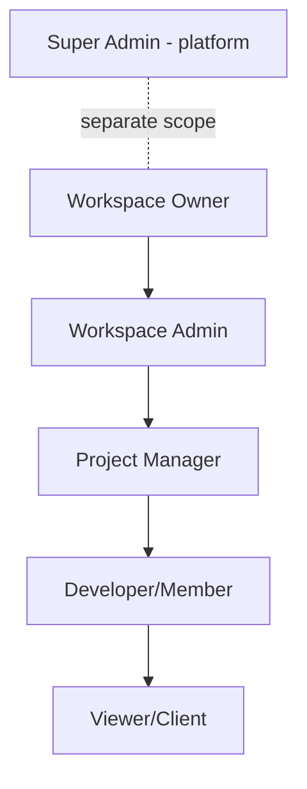

# 04 · User Roles & Permissions
> **Status:** Draft v1.0 · **Source:** MPD §2, §5.19 · **Depends on:** 01, 02 · **Full action matrix:** 36

## 1. Roles and responsibilities
| Role | Scope | Responsibility |
|---|---|---|
| Super Admin | Platform | Manage tenants, plans, system health. No default access to tenant content [RC: support access only via audited impersonation] |
| Workspace Owner | Workspace | Billing, members, all projects, delete workspace |
| Workspace Admin | Workspace | Manage members, projects, settings |
| Project Manager | Project | Sprints, epics, workflows, reports |
| Developer / Member | Project | Create/edit issues, comment, log time |
| Viewer / Client | Project | Read-only; commenting off by default |

## 2. Hierarchy

Higher workspace roles inherit lower-role permissions. Project roles can override workspace roles per project (e.g. a Developer as PM of one project).

## 3. Permission naming
`resource.action` (e.g. `issue.assign`). Permissions belong to roles via `role_permission`; system roles are seeded, custom roles are **[O]**.

## 4. Permission catalogue
| Group | Permissions |
|---|---|
| Workspace | workspace.view, workspace.update, workspace.delete, workspace.billing |
| Members | member.invite, member.remove, member.role_update, team.manage |
| Project | project.create, project.update, project.archive, project.delete, project.member_manage, workflow.manage |
| Issue | issue.view, issue.create, issue.update, issue.delete, issue.assign, issue.transition, issue.rank |
| Agile | sprint.create, sprint.start, sprint.complete, epic.manage |
| Collaboration | comment.create, comment.update_own, comment.delete_any, attachment.upload, attachment.delete |
| Time & reports | time.log, time.view_all, report.view |
| Admin | audit.view, filter.save, apitoken.manage, webhook.manage |

## 5. Summary matrix
✔ allowed · ✖ denied · ◐ conditional (see doc 36)
| Capability | WO | WA | PM | DEV | VW |
|---|---|---|---|---|---|
| Delete workspace / billing | ✔ | ✖ | ✖ | ✖ | ✖ |
| Invite / remove members | ✔ | ✔ | ✖ | ✖ | ✖ |
| Create project | ✔ | ✔ | ✖ | ✖ | ✖ |
| Configure workflow, manage sprints/epics | ✔ | ✔ | ✔ | ✖ | ✖ |
| Create/edit/assign issues | ✔ | ✔ | ✔ | ✔ | ✖ |
| Delete issues | ✔ | ✔ | ✔ | ✖ | ✖ |
| Comment | ✔ | ✔ | ✔ | ✔ | ◐ |
| View reports | ✔ | ✔ | ✔ | ◐ | ◐ |
| View audit logs | ✔ | ✔ | ✖ | ✖ | ✖ |

## 6. Access restrictions
- Every request is scoped to one workspace (doc 07).
- Users see only projects where they are members, unless workspace role is Owner/Admin. Public-within-workspace visibility is a project setting (doc 14).
- The last Owner cannot be removed or demoted.
- Viewers never see time entries or audit data.
