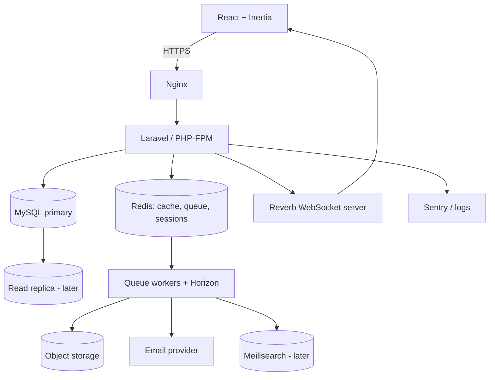

# 06 · System Architecture
> **Status:** Draft v1.0 · **Source:** MPD §7, §15 · **Depends on:** 01, 02 · **See also:** 07, 09, 10, 32

## 1. Architectural style
Modular monolith (Laravel) + React SPA delivered through Inertia. Chosen over microservices to keep transactions simple, deployment easy, and team size realistic; modules are separated by namespaces and services so extraction remains possible.

## 2. Component diagram

## 3. Layers
| Layer | Technology | Responsibility |
|---|---|---|
| Frontend | React 18, TypeScript, Tailwind, Inertia | Pages, components, live updates (doc 10) |
| Backend | Laravel 11+ | Business logic, policies, events (doc 09) |
| Database | MySQL 8 | Persistent data, shared schema (doc 08) |
| API | REST `/api/v1`, Sanctum | Integrations, async widgets (doc 11) |
| Authentication | Fortify sessions, Sanctum tokens | Doc 12 |
| Authorization | Policies + role/permission tables | Docs 04, 12, 36 |
| Queue | Redis + Horizon | Notifications, search, reports, scans (doc 19, 28) |
| Notifications | Database, mail, broadcast | Doc 19 |
| Storage | S3-compatible, pre-signed URLs | Doc 27 |
| External services | SMTP, S3, Sentry, ClamAV, Meilisearch [O] | – |

## 4. Communication rule
- **Inertia** for page navigation and first-load data.
- **REST API** for third-party clients and widget refreshes.
- **WebSockets** for push events only; state changes always go through HTTP.

## 5. Data flow (summary)
User action → HTTP request → middleware → validation → policy → service (transaction) → domain event → queued listeners (audit, notify, broadcast, index) → response. Detailed in docs 37 and 38.

## 6. Environments
Local (Docker), Staging, Production (doc 32).

## 7. Architecture decisions (ADR summary)
| ADR | Decision | Reason |
|---|---|---|
| 1 | Modular monolith | Simpler consistency, faster delivery |
| 2 | Shared DB with `workspace_id` | Lowest ops cost; see doc 07 |
| 3 | Inertia + selective REST | Less duplicated API code, integrations still supported |
| 4 | Reverb for WebSockets | First-party, Redis-scalable |
| 5 | Selective repositories | Only for search/reporting complexity |
