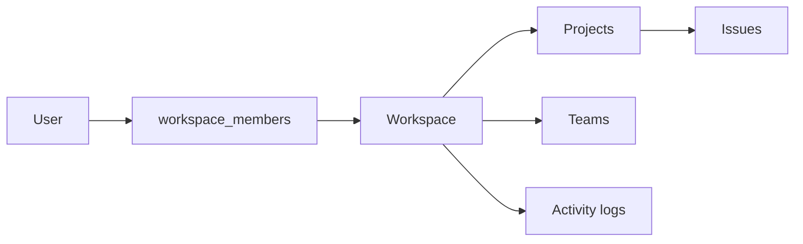

# 07 · Multi-Tenancy Architecture
> **Status:** Draft v1.0 · **Source:** MPD §7, §9 · **Depends on:** 04, 06, 08

## 1. Model
| Term | Meaning |
|---|---|
| Tenant / Organization | A **Workspace** (A2) |
| Member | A user linked via `workspace_members` with a role |
| Isolation strategy | Shared database, shared schema, `workspace_id` on all tenant-owned tables |

**Why not DB-per-tenant?** Higher operational cost and migration complexity; revisit for large enterprise customers **[O]**.

## 2. Tenant resolution
1. URL prefix `/w/{workspace-slug}` (web) or `X-Workspace` header / token ability (API).
2. Middleware loads workspace, verifies the authenticated user is a member (else 404, not 403, to avoid leaking existence).
3. Workspace set in a request-scoped tenant context object bound in the service container.

## 3. Tenant-aware queries
- Trait `BelongsToWorkspace` applies a **global scope** filtering by current workspace and auto-fills `workspace_id` on create.
- Composite indexes always lead with `workspace_id` (doc 08).
- Raw/report queries must include the tenant condition; enforced by code review checklist and tests.
- Queued jobs carry `workspace_id` and re-establish tenant context before running.

## 4. Authorization
Order of checks: authenticated → workspace member → workspace role permission → project membership/role → resource policy. Details in docs 04 and 36.

## 5. Cross-tenant security
| Threat | Control |
|---|---|
| ID guessing across tenants | Global scope + route model binding through tenant scope |
| Shared cache keys | Cache keys prefixed `ws:{id}:` |
| Broadcast leakage | Private channels authorised by membership |
| File access | Storage path `ws/{id}/…`, downloads via signed URL after policy check |
| Search leakage | Search index filtered by `workspace_id` |
| Job context bleed | Tenant reset between jobs (Horizon) |
| Support access | Super Admin impersonation is explicit and audited [RC] |

## 6. Workspace lifecycle
Create → active → suspended (billing, A4) → deleted (soft, 30-day grace, then purge job removes data and files).

## 7. Scaling strategy
Start shared schema; partition large tables (`activity_logs`, `notifications`) by month; add read replicas; if a tenant outgrows the pool, move to a dedicated database via a tenant → connection map **[O]**.

## 8. Required tests (doc 29)
Every tenant-owned model has a test proving user A of workspace 1 cannot read/update/delete workspace 2 data via web, API, broadcast, search and file routes.
