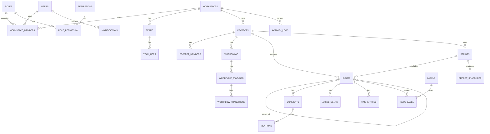

# 08 · Database Design
> **Status:** Draft v1.0 · **Source:** MPD §9 · **Depends on:** 05, 07 · **Used by:** 09, 11, 28

## 1. Conventions
MySQL 8, InnoDB, utf8mb4. PK `id` BIGINT UNSIGNED auto-increment. Timestamps `created_at`, `updated_at`. **SD** = soft deletes (`deleted_at`). Every tenant-owned table has `workspace_id` (FK, indexed first). Normalized to 3NF; JSON only for audit diffs, filters, report payloads. Columns marked *[RC]* are recommended supporting fields.

## 2. ERD

## 3. Tables
### Identity & tenancy
**users** — id, name VARCHAR(120), email VARCHAR(190) **UQ**, email_verified_at NULL, password VARCHAR(255), timezone VARCHAR(64), avatar_path NULL, two_factor_secret TEXT NULL, two_factor_confirmed_at NULL, is_super_admin BOOL. SD.
**workspaces** — id, name, slug **UQ**, owner_id FK users, plan VARCHAR(30), status ENUM(active,suspended). SD.
**roles** — id, workspace_id NULL (NULL = system role), name, scope ENUM(workspace,project). UQ(workspace_id, name).
**permissions** — id, key **UQ** (e.g. `issue.assign`), description.
**role_permission** — role_id FK, permission_id FK; PK(role_id, permission_id).
**workspace_members** — id, workspace_id, user_id, role_id, joined_at. UQ(workspace_id, user_id).
**teams** — id, workspace_id, name, description. UQ(workspace_id, name). **team_user** — team_id, user_id, PK both.
**invitations** — id, workspace_id, email, role_id, token CHAR(64) **UQ**, invited_by, expires_at, accepted_at NULL.

### Projects & workflow
**projects** — id, workspace_id, key VARCHAR(10), name, description, lead_id FK users, visibility ENUM(private,workspace) *[RC]*, template ENUM(scrum,kanban), issue_counter INT, archived_at NULL. UQ(workspace_id, key). SD.
**project_members** — id, project_id, user_id, role_id. UQ(project_id, user_id).
**workflows** — id, workspace_id, project_id, name.
**workflow_statuses** — id, workflow_id, name, category ENUM(todo,in_progress,done), position, wip_limit NULL.
**workflow_transitions** — id, workflow_id, from_status_id, to_status_id, required_field NULL. UQ(from, to).

### Work items
**issues** — id, workspace_id, project_id, number INT, type ENUM(bug,story,task,epic,subtask), title VARCHAR(255), description LONGTEXT, status_id FK, priority ENUM(lowest,low,medium,high,highest), assignee_id NULL, reporter_id, parent_id NULL (self FK), epic_id NULL (self FK), sprint_id NULL, rank VARCHAR(64), estimate_points DECIMAL(5,1) NULL, estimate_minutes INT NULL, due_date DATE NULL, resolution NULL, version INT default 1. SD.
 - Indexes: UQ(project_id, number); (project_id, status_id, rank); (assignee_id, status_id); (sprint_id, rank); (epic_id); (workspace_id, due_date); FULLTEXT(title, description).
**issue_links** *[RC]* — id, workspace_id, source_issue_id, target_issue_id, type ENUM(blocks,relates,duplicates). UQ(source, target, type).
**labels** — id, workspace_id, name, color. UQ(workspace_id, name). **issue_label** — issue_id, label_id.
**sprints** — id, workspace_id, project_id, name, goal, start_date, end_date, state ENUM(planned,active,completed), committed_points, completed_points NULL, started_at, completed_at. Index (project_id, state).

### Collaboration
**comments** — id, workspace_id, issue_id, user_id, parent_id NULL, body TEXT, edited_at NULL. SD. Index (issue_id, created_at).
**comment_revisions** *[RC]* — id, comment_id, body, created_at.
**mentions** — comment_id, mentioned_user_id; PK both.
**attachments** — id, workspace_id, issue_id, user_id, path, original_name, mime, size BIGINT, scan_status ENUM(pending,clean,infected). SD.
**time_entries** — id, workspace_id, issue_id, user_id, started_at, ended_at NULL, minutes INT, note. Index (user_id, started_at).

### System
**activity_logs** — id, workspace_id, actor_id NULL, subject_type, subject_id, action VARCHAR(60), changes JSON, ip VARBINARY(16), user_agent, created_at. **No updates or deletes.** Index (workspace_id, created_at), (subject_type, subject_id). Partition monthly.
**notifications** — id CHAR(36), user_id, workspace_id, type, data JSON, read_at NULL, created_at. Index (user_id, read_at, created_at).
**notification_preferences** — user_id, event_type, channel ENUM(in_app,mail), enabled. PK(user_id, event_type, channel).
**saved_filters** — id, workspace_id, user_id, project_id NULL, name, query JSON.
**report_snapshots** — id, workspace_id, sprint_id, date, payload JSON. UQ(sprint_id, date).
**personal_access_tokens** — Sanctum standard table.
**sessions, jobs, failed_jobs, cache** — Laravel standard tables (Redis used in production for cache/session/queue).

## 4. Pivot tables
team_user, role_permission, issue_label, mentions, project_members (with role), workspace_members (with role).

## 5. Normalization notes
Roles/permissions normalized; workflow statuses referenced by id (not strings); denormalized counters allowed only for `projects.issue_counter` and cached epic progress (cache, not column).

## 6. Soft-delete policy
SD on users, workspaces, projects, issues, comments, attachments. Never on audit logs, notifications (purged by schedule), or time entries (locked instead).
