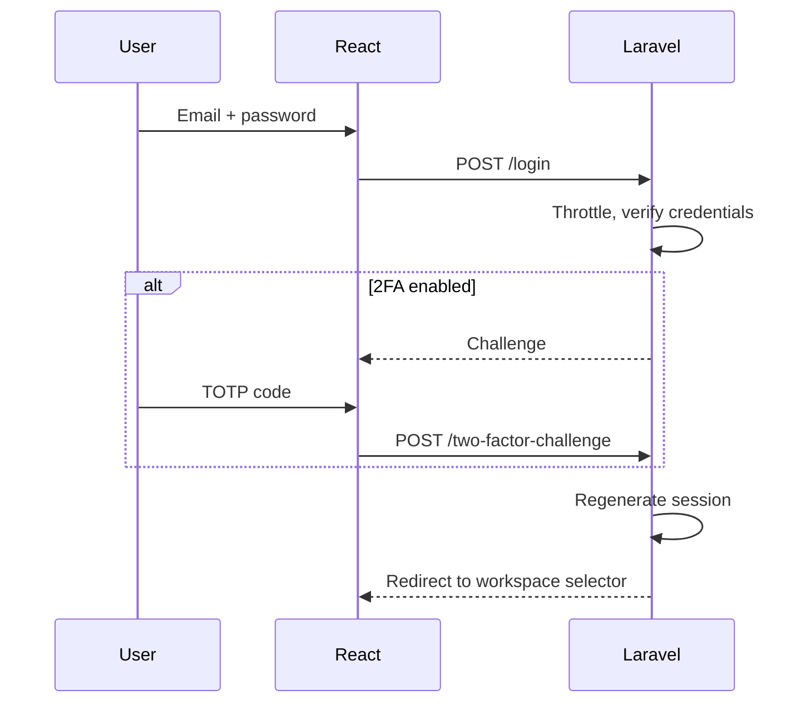
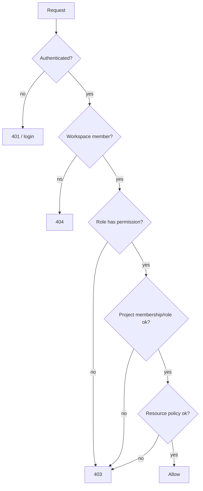

# 12 · Authentication & Authorization
> **Status:** Draft v1.0 · **Source:** MPD §8 · **Depends on:** 04, 05, 07 · **Security:** 26

## 1. Mechanisms
| Need | Mechanism |
|---|---|
| Web app | Session cookie via Laravel Fortify |
| API/integrations | Sanctum personal access tokens with abilities |
| 2FA | TOTP + recovery codes |
| Authorization | Policies + permission resolver |

## 2. Requirements
| Function | Rule |
|---|---|
| Registration | Name, email, password (≥ 12 chars); optionally accept invitation token |
| Email verification [RC] | Required before creating a workspace |
| Login | Throttled per email + IP (5 attempts/min, A8); session ID regenerated |
| Logout | Invalidates session; token revoke for API |
| Password reset | Signed, expiring (60 min) link, single use; all sessions revoked after reset |
| Sessions | Idle timeout 120 min; user can list/revoke sessions |
| Tokens | Hashed at rest; expiry configurable; scoped abilities |
| 2FA | Optional per user; workspace can require it [RC] |

## 3. Authentication flow

## 4. Authorization flow

## 5. RBAC details
- Permissions resolved per user per workspace, cached in Redis (`ws:{id}:perm:{user}`), invalidated on role change.
- Project role overrides workspace role only inside that project.
- Super Admin abilities are platform-only (tenants, plans, health); they do not bypass tenant policies.

## 6. Edge cases
Invite for an existing email; invited email differs from logged-in email (blocked); last Owner demotion blocked; 2FA lost device (recovery codes, admin-assisted reset with audit); token used after member removal (rejected, tokens tied to membership).
