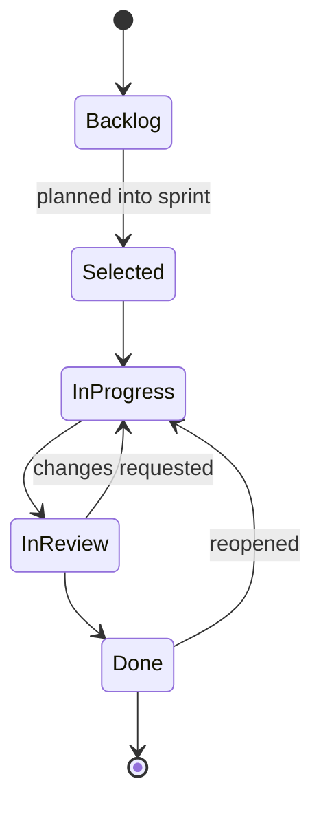

# 15 · Issue Management Module
> **Status:** Draft v1.0 · **Source:** MPD §5.3, §5.8 · **Depends on:** 05, 08, 14 · **Related:** 16, 17, 20

## 1. Issue types
| Type | Use | Tag |
|---|---|---|
| Bug | Defect | R |
| Story | User-facing requirement ("Feature" is treated as Story, A3) | R |
| Task | Technical/work item | R |
| Epic | Container for stories/tasks | R |
| Subtask | Child of a task/story/bug (one level) | R |

## 2. Fields
| Field | Notes |
|---|---|
| Key | `PROJECTKEY-number` e.g. NEX-142 |
| Title, description | Rich text, sanitized |
| Status | From workflow |
| Priority | Lowest…Highest |
| Assignee / Reporter | Assignee must be project member |
| Labels | Workspace-level labels |
| Due date, estimate | Points and/or minutes |
| Parent / Epic / Sprint | Hierarchy and planning |
| Attachments, comments | Docs 20, 27 |
| Dependencies (links) | Blocks/relates/duplicates **[RC]** |
| Version | Optimistic locking |

## 3. Lifecycle

(Default workflow; projects may customize, doc 16.)

## 4. Backend logic
Create: transaction → lock project row → increment `issue_counter` → insert → dispatch `IssueCreated`. Update: compare `version`; changed fields diffed for audit. Delete: soft delete; children un-parented or blocked with prompt.

## 5. Frontend
Quick-create modal, full form, detail drawer with inline editing (optimistic update; revert on error), history tab from activity logs.

## 6. Security & edge cases
Policies per action; HTML sanitization; moving issue between projects re-keys and logs; concurrent edit (409 + refresh prompt); closing parent with open subtasks (BR-ISS-05); assignee removed from project (auto-unassign + notify).
