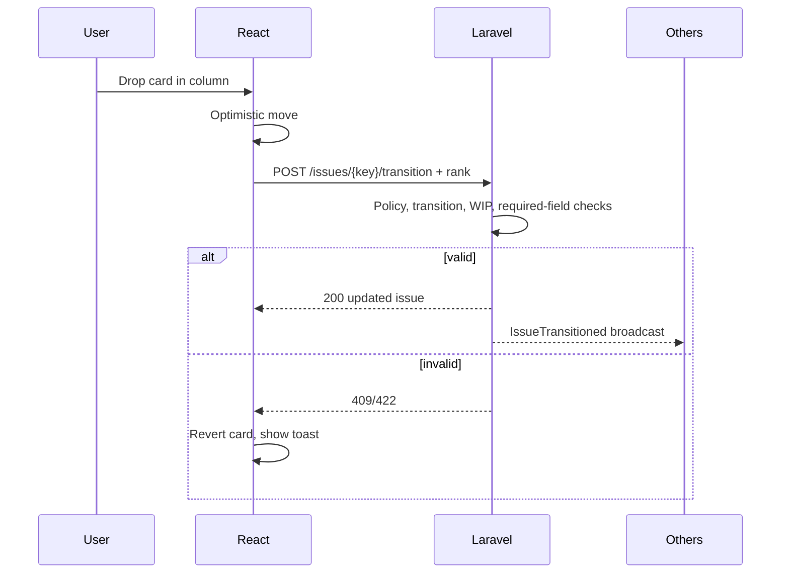

# 16 · Kanban Board & Workflow
> **Status:** Draft v1.0 · **Source:** MPD §5.4 · **Depends on:** 05, 15 · **Related:** 17, 19

## 1. Concepts
| Term | Meaning |
|---|---|
| Workflow | Set of statuses and allowed transitions per project |
| Status | Named step with category todo / in_progress / done |
| Column | Board representation of one status (or several) |
| Card | An issue on the board |

Default statuses: To Do → In Progress → In Review → Done.

## 2. Requirements
| Feature | Requirement | Tag |
|---|---|---|
| Columns | One per status, configurable order | R |
| Drag and drop | Moves card between columns/positions; keyboard alternative | R |
| Workflow rules | Only allowed transitions; required fields enforced | R |
| WIP limits | Per column; badge turns red when exceeded | R |
| Filters | Assignee, label, epic, type, text, "my issues" | R |
| Swimlanes | By assignee or epic | O |
| Board permissions | View: issue.view; move: issue.transition; edit columns/WIP: workflow.manage | R |
| Scope | Scrum board shows active sprint; Kanban board shows all non-done | R |

## 3. Move flow

## 4. Ranking
Position stored as sortable string rank (fractional between neighbors); rebalanced by job when gaps become too small. Two simultaneous drags resolve last-write-wins on rank, with both clients re-syncing from broadcast.

## 5. Data / API / Security
Tables: workflows, workflow_statuses, workflow_transitions, issues.rank. Endpoints: `/projects/{p}/board`, `/issues/{key}/transition`, `/issues/{key}/rank`, `/projects/{p}/workflow`.

## 6. Edge cases
Transition requires resolution (modal prompt); WIP exceeded; card moved by another user mid-drag; status deleted while in use (blocked, BR-WFL-03); done → reopen; two boards showing same issue.
