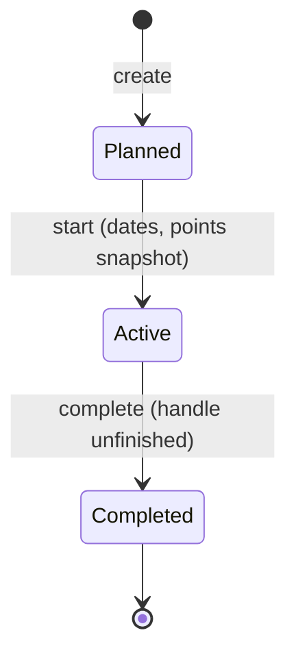

# 17 · Sprint & Backlog Management
> **Status:** Draft v1.0 · **Source:** MPD §5.5–5.7 · **Depends on:** 05, 15, 16 · **Reports:** 23

## 1. Backlog
- **Product backlog:** issues with no sprint, ordered by rank; drag to reprioritize; bulk edit (assignee, priority, labels, move to sprint).
- **Sprint backlog:** issues assigned to a planned/active sprint.
- Epics can be used as filter and grouping.

## 2. Sprint lifecycle

## 3. Requirements
| Function | Requirement |
|---|---|
| Creation | Name, goal, start/end dates |
| Planning | Drag from backlog; capacity indicator vs. velocity average [RC] |
| Start | BR-SPR-02/03/04; snapshot committed points; notify members |
| During sprint | Scope changes allowed and logged (BR-SPR-05); daily burndown snapshot |
| Completion | Dialog: move unfinished to backlog or next sprint; compute completed points and velocity |
| Issue movement | Logged in activity; broadcasts board changes |
| Reports | Sprint report, burndown, velocity (doc 23) |

## 4. Burndown requirements
Ideal line from committed points; actual line from daily `report_snapshots` (remaining points); scope-change markers; shows non-working days as flat **[RC]**.

## 5. Sprint workflow (example)
Nexora **Sprint 7**, Mar 3–14, goal "Stable live map": PM creates sprint → team drags 34 points from backlog → PM starts → board used daily → nightly job snapshots remaining points → PM completes on Mar 14; 2 unfinished issues move to Sprint 8 → velocity updates.

## 6. Data / API / Security
Tables: sprints, issues.sprint_id, report_snapshots. Endpoints: doc 11. Permissions: sprint.create/start/complete; DEV can view.

## 7. Edge cases
Start with no issues (warning); overlapping dates rejected; completing with open subtasks; issue deleted mid-sprint (points removed, logged); sprint extended past end date (allowed, dates edited and logged); timezone: sprint boundaries use workspace timezone [RC].
