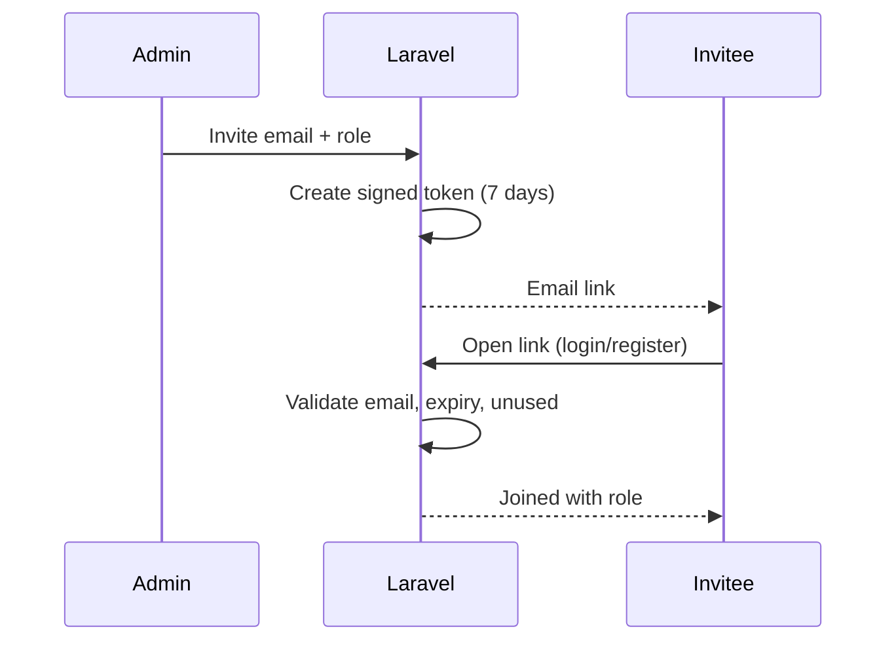

# 18 · Team & Organization (Workspace) Management
> **Status:** Draft v1.0 · **Source:** MPD §5.2 · **Depends on:** 04, 07 · **Terminology:** Organization = Workspace (A2)

## 1. Workspace management
| Function | Requirement |
|---|---|
| Create | Name, slug; creator becomes Owner |
| Settings | Name, logo, default timezone, allow viewer comments, require 2FA [RC], default notification prefs |
| Switching | Header workspace switcher for multi-workspace users |
| Delete | Owner only; soft delete, 30-day grace (doc 07) |

## 2. Members & invitations

Admins can resend, revoke, change role, remove members. Last Owner protected.

## 3. Teams
Teams group members for bulk project assignment and notifications (@team mention **[O]**). Team roles: **Team Lead** (manages team membership) and **Member**. Teams do not grant permissions by themselves; permissions come from workspace/project roles.

## 4. Team permissions
`team.manage` (Owner, Admin) creates/edits teams; Team Lead may edit membership of own team [RC].

## 5. Data / API / Edge cases
Tables: workspaces, workspace_members, teams, team_user, invitations. Endpoints: doc 11. Edge cases: inviting existing member; expired/reused token; removing member owning open issues (BR-ORG-04); user removed while online (session loses access on next request, broadcast channel auth fails).
