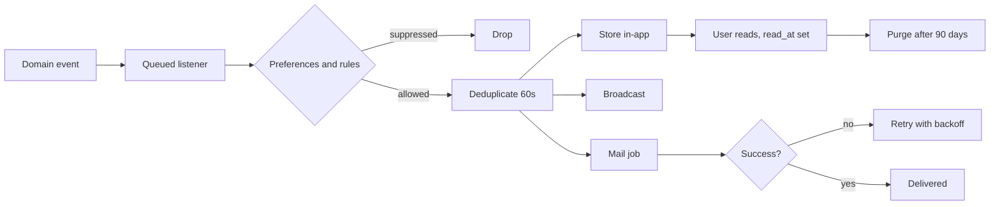

# 19 · Notification System
> **Status:** Draft v1.0 · **Source:** MPD §5.12–5.13 · **Depends on:** 05, 09

## 1. Channels
| Channel | Delivery | Tag |
|---|---|---|
| In-app | `notifications` table + real-time broadcast on `user.{id}` | R |
| Email | Queued mail; digest option | R |
| Slack/webhook | Outbound | O |

## 2. Triggers
| Event | Recipients | Default channels |
|---|---|---|
| Issue assigned | New assignee | In-app, email |
| Mentioned in comment | Mentioned user | In-app, email |
| Comment on watched issue | Reporter, assignee, watchers | In-app |
| Status changed | Reporter, watchers | In-app |
| Sprint started/completed | Project members | In-app |
| Due date approaching (24 h) | Assignee | In-app, email |
| Invitation | Invitee | Email |
| Security events (login new device, 2FA change) | User | Email (cannot disable) |

## 3. Preferences
Per user per event type per channel (`notification_preferences`); defaults set by workspace; quiet hours **[O]**.

## 4. Lifecycle

## 5. Queues & jobs
Queue `notifications` (separate workers from `default`). Jobs: SendNotification, SendDigestEmail (scheduled hourly/daily), PurgeOldNotifications. Retries 3 with exponential backoff; failures to `failed_jobs`, alerted (doc 32).

## 6. Rules & edge cases
BR-NTF-01..04. Edge: mentioned user lost access (skip); bulk operations (aggregate into one notification); mail provider outage (retry, in-app still delivered); user in multiple workspaces (notification tagged with workspace).
