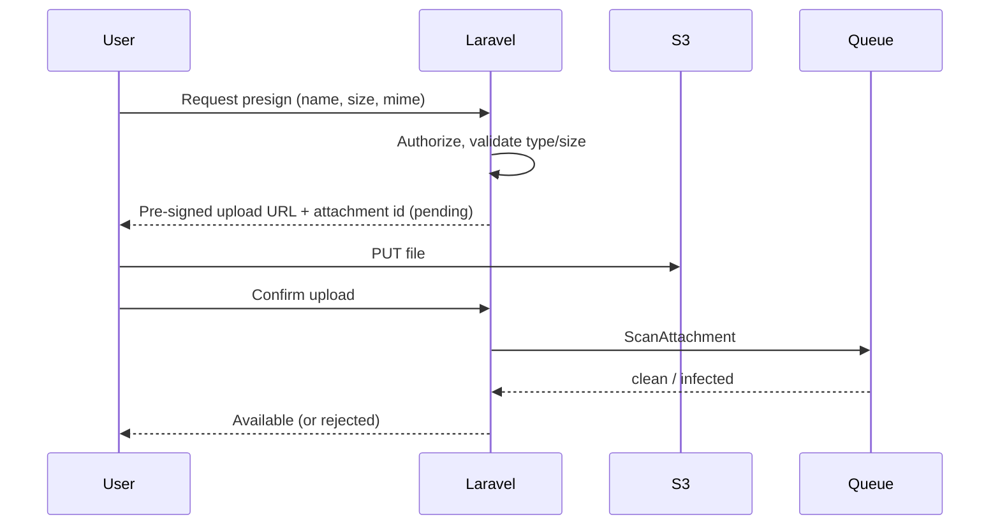

# 27 · File & Storage System
> **Status:** Draft v1.0 · **Source:** MPD §5.10 · **Depends on:** 05, 26 · **Related:** 15, 20

## 1. Requirements
| Area | Requirement |
|---|---|
| Storage | S3-compatible private bucket; local disk in development |
| Path | `ws/{workspace_id}/issues/{issue_id}/{uuid}.{ext}` (random name, original name in DB) |
| Size limit | 25 MB per file (BR-FIL-01); avatars 2 MB; configurable per plan [O] |
| Allowed types | Images (png, jpg, gif, webp), pdf, txt, csv, docx/xlsx/pptx, zip; blocked: executables and scripts. Validate extension **and** detected MIME |
| Scanning | ClamAV via queued `ScanAttachment`; status pending → clean/infected; infected files quarantined and uploader notified |
| Permissions | Upload: `attachment.upload`; view/download: `issue.view`; delete: uploader or `attachment.delete` |
| Ownership | `user_id` uploader, `workspace_id`, `issue_id` |

## 2. Upload flow

## 3. Secure downloads
Short-lived signed URLs (5 min) generated after policy check; `Content-Disposition: attachment` for non-image types; images served with safe content type.

## 4. Deletion
Soft delete first; purge job removes object after 30 days; workspace purge removes all `ws/{id}/` objects.

## 5. Edge cases
Upload abandoned (cleanup of pending > 24 h); duplicate names; MIME spoofing (server-side detection); scan service down (files stay pending, retry); storage quota per workspace [O]; issue deleted (attachments follow soft-delete).
