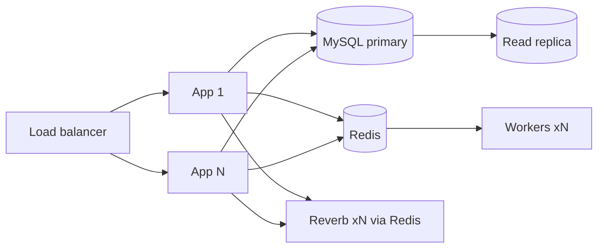

# 28 · Performance & Scalability
> **Status:** Draft v1.0 · **Source:** MPD §14–15 · **Depends on:** 06, 08 · **Targets:** NFR-01..05 (doc 02)

## 1. Database
| Practice | Detail |
|---|---|
| Indexing | Composite indexes leading with `workspace_id`; see doc 08; review with `EXPLAIN` on slow-query log |
| Query optimization | Select needed columns, avoid `OFFSET` on large tables (cursor), covering indexes for board/backlog |
| Eager loading | `preventLazyLoading()` outside production; resources load relations explicitly |
| Pagination | Cursor; max 100 |
| Large datasets | Partition `activity_logs`/`notifications`; archive old rows; report snapshots instead of live aggregation |

## 2. Caching (Redis)
| Data | TTL / invalidation |
|---|---|
| Permissions per user/workspace | Until role change (tagged) |
| Dashboard aggregates | 5 min |
| Report results | 5–15 min |
| Workflow definitions | Until updated |
| Epic progress | Recomputed on issue change (event) |
Keys prefixed `ws:{id}:`; cache stampede protection with locks.

## 3. Queues & background processing
Queues: `default`, `notifications`, `search`, `reports`, `scans`. Horizon autoscaling by queue depth. All jobs idempotent, unique where needed.

## 4. React performance
Code splitting per route, virtualized backlog/board lists for > 200 cards, memoized `IssueCard`, debounced search, deferred props for heavy widgets, image lazy loading, asset hashing + CDN.

## 5. Scaling strategy

1. Stateless app servers (sessions in Redis). 2. Scale workers per queue. 3. Read replicas for reports/search. 4. Reverb horizontal scaling. 5. Meilisearch for search [O]. 6. Tenant-to-database sharding as last step [O].

## 6. Performance budgets & testing
API p95 < 300 ms, page p95 < 500 ms, board load < 1.5 s for 500 cards, real-time < 1 s. Load tests (k6) at 500 concurrent users on staging before release (doc 30).
