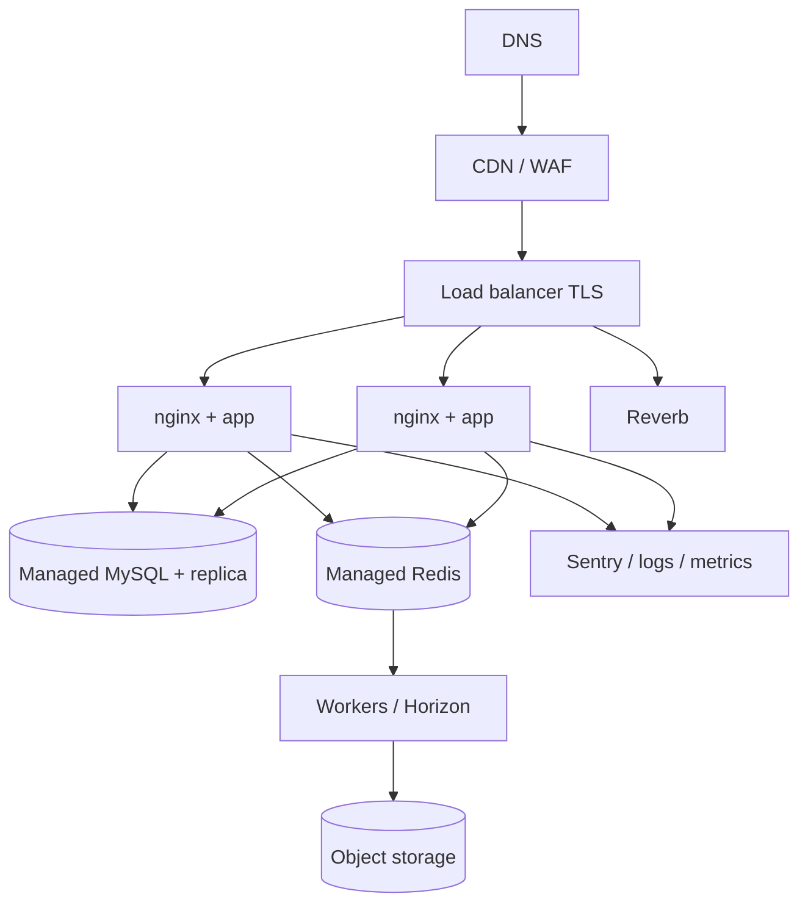

# 32 · DevOps & Deployment
> **Status:** Draft v1.0 · **Source:** MPD §15 · **Depends on:** 06, 28 · **Pipelines:** 33

## 1. Environments
| Env | Purpose | Notes |
|---|---|---|
| Development | Local Docker Compose | Seeded demo data, Mailpit, local storage |
| Staging | Production-like | Auto-deploy from `main`; anonymized data; load/E2E tests |
| Production | Live | Manual approval, backups, monitoring |

## 2. Containers (Docker Compose locally, orchestrated in production)
| Service | Role |
|---|---|
| nginx | TLS termination, static files, proxy to PHP-FPM and Reverb |
| app (PHP-FPM) | Laravel |
| worker | `queue:work` / Horizon |
| scheduler | `schedule:work` (snapshots, purge, stale timers, digests) |
| reverb | WebSocket server |
| mysql | Database (managed service in production) |
| redis | Cache/queue/session (managed in production) |
| mailpit | Dev mail |
| node (build) | Vite asset build stage |
Multi-stage images, non-root user, read-only filesystem where possible, health checks.

## 3. Deployment architecture

## 4. Environment variables (categories)
App (key, env, URL) · DB · Redis · Mail · Storage (S3) · Reverb · Sentry · Rate limits · Feature flags. Secrets from secret manager, never in repo; `.env.example` documented.

## 5. Deployment process
Build image → run tests → push to registry → deploy staging → smoke tests → approval → production rolling deploy: migrations (backward-compatible, expand/contract), cache warm, `queue:restart`, health checks, automatic rollback to previous image on failure.

## 6. Operations
Backups: daily full + PITR; restore drill quarterly. Monitoring: uptime, error rate, queue depth/latency, slow queries, WebSocket connections. Alerts: failed jobs, 5xx spike, disk, certificate expiry. Log aggregation with 30-day search.
