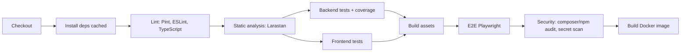

# 33 · CI/CD & GitHub Workflow
> **Status:** Draft v1.0 · **Source:** MPD §15 · **Depends on:** 29, 32

## 1. Git strategy
Trunk-based: protected `main`, short-lived branches `feature/…`, `fix/…`, `chore/…`, `docs/…`. Release tags `vMAJOR.MINOR.PATCH` (SemVer). Hotfix branches from latest tag.

## 2. Pull requests & review
PR template: summary, linked issue, screenshots, test evidence, migration notes, security checklist. Rules: ≥ 1 approval (CODEOWNERS for policies/migrations), all checks green, branch up to date, squash merge.

## 3. Commit conventions
Conventional Commits: `feat(issues): add subtask limit`, `fix(board): revert on 409`, `docs`, `test`, `refactor`, `chore`, `ci`.

## 4. CI pipeline (on PR/push)

## 5. CD pipeline
| Stage | Trigger | Actions |
|---|---|---|
| Staging | Merge to `main` | Push image, deploy, migrate, smoke tests |
| Production | Tag `v*` + manual approval | Deploy rolling, migrate, health check, notify |
| Rollback | Manual/auto | Redeploy previous image; migrations backward-compatible |

## 6. Release process
Release branch not needed; changelog generated from commits; release notes; tag; deploy; post-release verification and monitoring window (30 min). Dependabot weekly updates; monthly dependency review.
