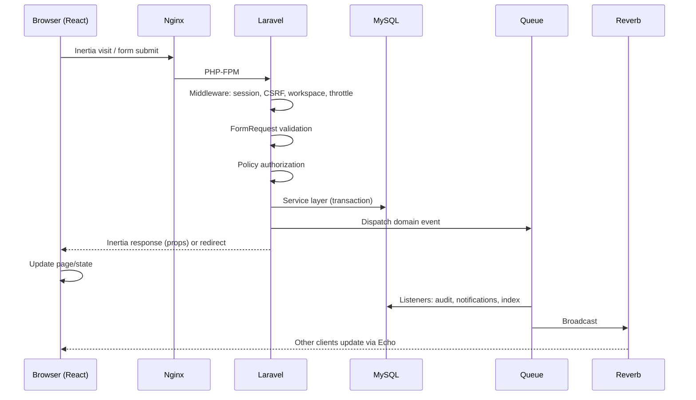

# 37 · Data Flow & Request Lifecycle
> **Status:** Draft v1.0 · **Source:** MPD §12 · **Depends on:** 06, 09, 10, 11

## 1. Web request lifecycle (Inertia)

## 2. Stage responsibilities
| Stage | Responsibility | Doc |
|---|---|---|
| Browser/React | Render, optimistic UI, form state | 10 |
| Inertia / API | Page props / JSON | 11 |
| Route | Named routes grouped by middleware | 09 |
| Middleware | Auth, tenant, throttle, headers | 07, 09 |
| Controller | Delegates only | 09 |
| Validation | FormRequest | 09 |
| Authorization | Policy | 04, 36 |
| Service layer | Rules, transaction, events | 09 |
| Database | Tenant-scoped queries | 08 |
| Response | Inertia props / API Resource | 11 |
| Frontend update | Props merge, store update | 10 |

## 3. REST/API lifecycle
Same pipeline without Inertia: token auth → tenant header → validation → policy → service → Resource → JSON envelope.

## 4. Background flows
| Flow | Trigger | Steps |
|---|---|---|
| Notifications | Domain event | Listener → preferences → dedupe → DB + broadcast + mail job |
| Audit | Domain event | Listener → insert `activity_logs` |
| Search indexing | Issue events | Queued `IndexIssue` (when Meilisearch enabled) |
| Attachment scan | Upload confirm | `ScanAttachment` → status update → notify on infection |
| Burndown snapshot | Scheduler nightly | For each active sprint, store remaining points |
| Timer cleanup | Scheduler hourly | Stop timers > 12 h |
| Purge | Scheduler daily | Expired invitations, old notifications, deleted workspaces/files |
| Digest email | Scheduler | Aggregated notifications |

## 5. Real-time event flow
Service dispatches `ShouldBroadcast` event **after commit** → Redis → Reverb → private channel (`project.{id}`, `user.{id}`) authorised by membership → Echo → `useChannel` → store update. Sender ignores own event via socket id.
