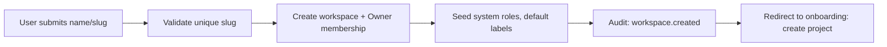
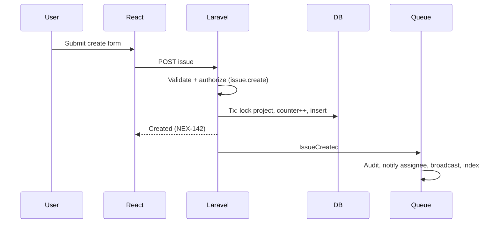

# 38 · System Workflows
> **Status:** Draft v1.0 · **Source:** MPD §12 · **Depends on:** 05, 12, 15–19

## 1. Registration & login
Register → validate → create user → (verify email RC) → login → optional 2FA → workspace selector (or create/accept invite). See doc 12 diagrams.

## 2. Organization (workspace) creation

## 3. Member invitation
Admin invites → token created → mail queued → invitee opens link → login/register → email match check → membership with role → audit + notify admin.

## 4. Project creation
Validate key/lead → create project → seed workflow → add members → audit → redirect to board.

## 5. Issue creation

## 6. Issue assignment
Authorize `issue.assign` → verify assignee is project member → update (version check) → audit diff → notify assignee unless self-assign → broadcast `IssueUpdated`.

## 7. Status change
Authorize → validate transition → check required fields and WIP → update status + rank → audit → notify reporter/watchers → broadcast board change → if done and sprint active, update progress cache.

## 8. Sprint lifecycle
Create (planned) → plan issues → start (validations, snapshot, notify) → daily snapshots → scope changes logged → complete (handle unfinished, compute velocity) → report available. Diagram in doc 17.

## 9. Notification lifecycle
Event → listener → preferences → dedupe → store/broadcast/mail → read → purge. Diagram in doc 19.

## 10. File upload
Presign → direct upload → confirm → virus scan → available/quarantined. Diagram in doc 27.

## 11. Comment workflow
Submit → sanitize → store → parse mentions → audit → notify (mentioned, watchers) → broadcast to issue channel → appears live for viewers.
