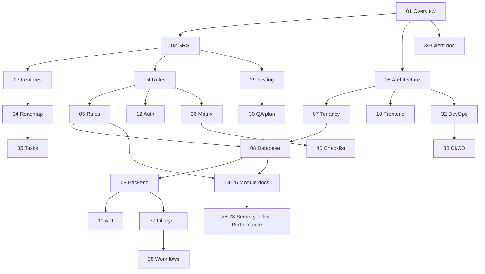

# Documentation Index
**Project:** Enterprise Project Management & Collaboration Platform · **Source of truth:** Master Project Document (see doc 01, assumption A1) · **Version:** 1.0 (Draft) · **Terminology:** Workspace = Organization (A2).

## 1. Documents
| # | File | Purpose | Depends on | Status |
|---|---|---|---|---|
| 01 | 01-project-overview.md | Vision, scope, modules, conventions, assumptions | – | Draft |
| 02 | 02-srs.md | Requirements (functional, non-functional, acceptance) | 01 | Draft |
| 03 | 03-feature-requirements.md | Feature list, priorities, MVP vs advanced | 01, 02 | Draft |
| 04 | 04-user-roles-and-permissions.md | Roles, hierarchy, permissions | 01, 02 | Draft |
| 05 | 05-business-rules.md | Rules `BR-*` | 02, 04 | Draft |
| 06 | 06-system-architecture.md | Overall architecture, ADRs | 01, 02 | Draft |
| 07 | 07-multi-tenancy-architecture.md | Tenant isolation | 04, 06, 08 | Draft |
| 08 | 08-database-design.md | Schema, ERD | 05, 07 | Draft |
| 09 | 09-laravel-backend-architecture.md | Backend structure | 06–08 | Draft |
| 10 | 10-react-frontend-architecture.md | Frontend structure | 06, 11 | Draft |
| 11 | 11-api-documentation.md | REST API | 08, 09, 12 | Draft |
| 12 | 12-authentication-and-authorization.md | Auth flows | 04, 05, 07 | Draft |
| 13 | 13-ui-ux-requirements.md | Design and UX rules | 03, 10 | Draft |
| 14 | 14-project-management-module.md | Projects | 04, 05, 08 | Draft |
| 15 | 15-issue-management-module.md | Issues | 05, 08, 14 | Draft |
| 16 | 16-kanban-and-workflow.md | Board and workflow | 05, 15 | Draft |
| 17 | 17-sprint-and-backlog-management.md | Sprints, backlog | 05, 15, 16 | Draft |
| 18 | 18-team-and-organization-management.md | Workspace, teams, invitations | 04, 07 | Draft |
| 19 | 19-notification-system.md | Notifications | 05, 09 | Draft |
| 20 | 20-comments-and-collaboration.md | Comments, mentions | 15, 19, 27 | Draft |
| 21 | 21-time-tracking.md | Time tracking | 05, 15 | Draft |
| 22 | 22-calendar-and-scheduling.md | Calendar | 15, 17 | Draft |
| 23 | 23-reports-and-analytics.md | Reports | 08, 17, 21 | Draft |
| 24 | 24-search-and-filtering.md | Search | 08, 15 | Draft |
| 25 | 25-audit-logging.md | Audit log | 05, 08 | Draft |
| 26 | 26-security-requirements.md | Security | 07, 12, 25 | Draft |
| 27 | 27-file-and-storage-system.md | Files | 05, 26 | Draft |
| 28 | 28-performance-and-scalability.md | Performance | 06, 08 | Draft |
| 29 | 29-testing-strategy.md | Testing | 02, 09, 10 | Draft |
| 30 | 30-qa-test-plan.md | QA plan | 29, 36, 40 | Draft |
| 31 | 31-error-handling.md | Errors and logging | 09, 11 | Draft |
| 32 | 32-devops-and-deployment.md | Environments, Docker | 06, 28 | Draft |
| 33 | 33-ci-cd-github-workflow.md | Git, CI/CD | 29, 32 | Draft |
| 34 | 34-development-roadmap.md | Phases, milestones | 03 | Draft |
| 35 | 35-project-task-breakdown.md | Task list | 03, 34 | Draft |
| 36 | 36-api-security-and-permission-matrix.md | Permission matrix | 04, 11, 26 | Draft |
| 37 | 37-data-flow-and-request-lifecycle.md | Request lifecycle | 06, 09–11 | Draft |
| 38 | 38-system-workflows.md | End-to-end workflows | 05, 12, 15–19 | Draft |
| 39 | 39-client-documentation.md | Non-technical overview | 01 | Draft |
| 40 | 40-final-feature-checklist.md | QA/client checklist | 02, 03, 36 | Draft |

## 2. Dependency map

## 3. Recommended reading order
- **Everyone:** 01 → 39 → 03.
- **Product/BA:** 02 → 04 → 05 → 14–25 → 13 → 38.
- **Backend developer:** 06 → 07 → 08 → 09 → 11 → 12 → 36 → 37 → module docs → 26 → 31.
- **Frontend developer:** 06 → 10 → 13 → 11 → module docs → 16 → 17.
- **DevOps:** 06 → 32 → 33 → 28.
- **QA:** 02 → 05 → 29 → 30 → 36 → 40.
- **Planning:** 34 → 35 → 40.

## 4. Source of truth & conflict rule
1. Master Project Document (assumption A1) wins over everything.
2. Within this set: 05 (rules) and 36 (permissions) govern behavior; 08 governs schema; 11 governs API contracts. Other documents cross-reference, not redefine.
3. Items not in the Master Document are tagged **[RC]** or **[O]**; assumptions are A1–A8 in doc 01.

## 5. Known gaps and assumptions to confirm
| Area | Question |
|---|---|
| Master Document | The MPD file itself was not attached; A1 assumes it is the published system-design document. Please confirm or attach your version. |
| Billing | Out of scope (A4); confirm plans/limits if needed |
| Retention | 24 months audit (A6) needs confirmation |
| SLA | 99.5 % / RPO / RTO values are starting points (A8) |
| Custom roles | Treated as optional [O] |

## 6. Documentation status
All 40 documents: **Draft v1.0**. Next step: review against the MPD, resolve section 5 questions, then freeze v1.1 before development (Phase 1, doc 34).
