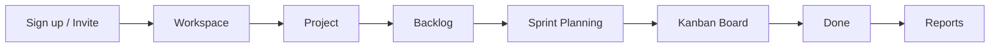
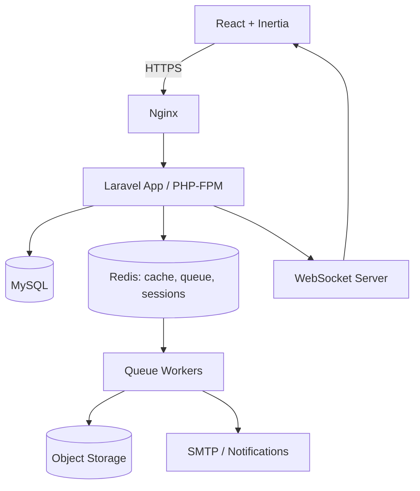
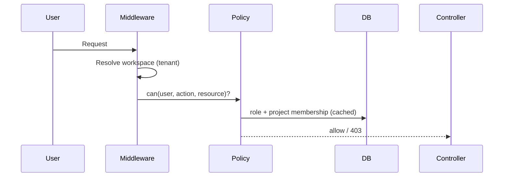
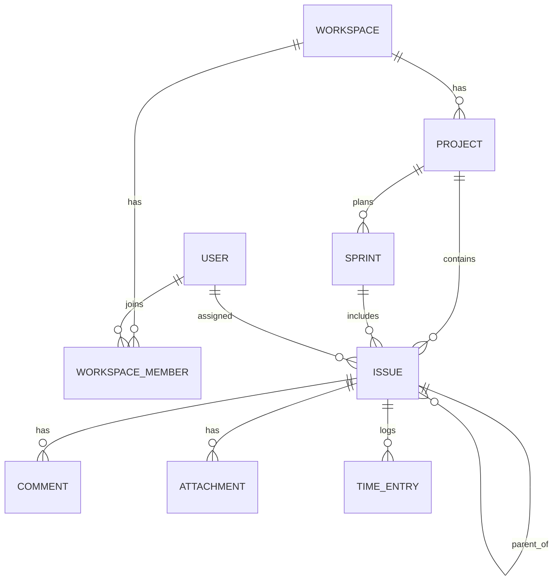
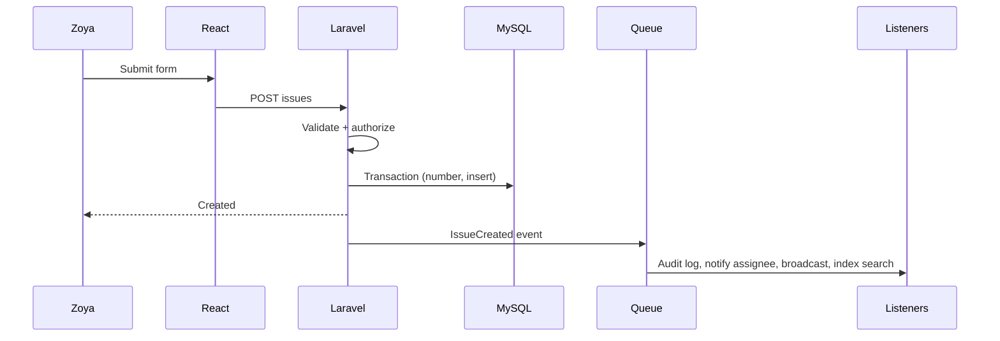
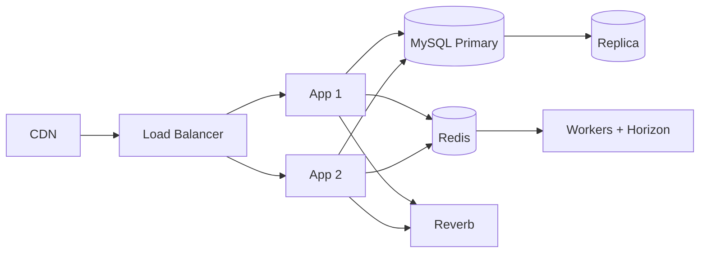

# Enterprise Project Management & Collaboration Platform
**System Design & Architecture Documentation** · Laravel · React · Inertia.js · MySQL · Redis · Docker

---

## 1. Overview, Problem, Goals (Sections 1–3)

**Overview.** A multi-tenant SaaS where organizations plan, track and ship work using projects, issues, sprints, Kanban boards, and real-time collaboration. Comparable to Jira, but simpler, faster, and built on a maintainable Laravel monolith with a React (Inertia) frontend.

**Business problem.** Example: *Nexora Logistics* (120 staff) tracks work across spreadsheets, chat and email. Consequences: no single source of truth, lost requests, unclear ownership, no sprint visibility, no audit trail for compliance.

**Goals**
| Goal | Measure |
|---|---|
| Single source of truth for work | Every task is an issue with owner, status, history |
| Real-time visibility | Board updates < 1s for all viewers |
| Enterprise readiness | RBAC, audit logs, tenant isolation |
| Engineering quality | >80% backend test coverage, CI-gated merges |
| Scalability | 500 concurrent users per workspace, 1M+ issues |

## 2. Target Users & Roles (Sections 4–5)

Target users: software teams, agencies, IT departments, PMOs.

| Role | Scope | Key permissions |
|---|---|---|
| Super Admin | Platform | Manage tenants, plans, system health |
| Workspace Owner | Workspace | Billing, members, all projects, delete workspace |
| Workspace Admin | Workspace | Manage members, projects, settings |
| Project Manager | Project | Sprints, epics, workflows, reports |
| Developer / Member | Project | Create/edit issues, comment, log time |
| Viewer / Client | Project | Read-only, comment optional |

Permissions follow `resource.action` (e.g. `issue.assign`, `sprint.start`). Roles are workspace-scoped; project-level overrides are allowed.

## 3. Core & Advanced Features (Sections 6–7)

**Core:** auth, workspaces, projects, issues, subtasks, Kanban, backlog, comments, attachments, notifications, search, profile.
**Advanced:** sprints & epics, mentions, real-time updates, audit logs, time tracking, calendar, analytics (burndown, velocity), custom workflows, saved filters, webhooks, SSO-ready auth, API tokens.

## 4. User & Admin Flows (Sections 8–9)

**User flow:** Register/invite → join workspace → open project → view backlog → create issue → plan into sprint → move on board → comment/mention → log time → resolve → see reports.

**Admin flow:** Create workspace → invite members with roles → create project + workflow → configure issue types/priorities → monitor audit logs and usage → manage billing/settings.



## 5. Feature Specifications (Sections 10–29)

Each feature: purpose → business need → UX → backend → frontend → data → API → security → edge cases.

### 5.1 Project Management (10)
- **What/why:** Container for issues with key (e.g. `NEX`), lead, workflow. Gives teams scoped ownership.
- **UX:** Create project, choose template (Scrum/Kanban), set lead.
- **Backend:** `ProjectService` generates unique key, seeds default workflow and issue types.
- **Frontend:** Project switcher, settings tabs.
- **Data:** `projects`, `project_members`. **API:** `/projects` CRUD.
- **Security:** Policy checks membership. **Edge cases:** duplicate keys, archiving with open issues, lead leaving.

### 5.2 Workspace & Team Management (11)
- Tenant boundary. Users invite by email (signed, expiring link); roles assigned per membership. Teams group users for bulk assignment/notifications.
- **Data:** `workspaces`, `workspace_members`, `teams`, `team_user`, `invitations`.
- **Edge cases:** invite to existing user, last-owner removal blocked, user in multiple workspaces, revoked invite reuse.

### 5.3 Issue / Ticket Management (12)
- **Issue types:** Bug, Story, Task, Epic, Subtask. **Fields:** key (`NEX-142`), title, description (rich text), status, priority, assignee, reporter, estimate, labels, due date, parent.
- **Backend:** `IssueService::create` in a transaction: allocate sequence number (row lock on project counter), persist, dispatch `IssueCreated`.
- **Frontend:** Modal create form, detail drawer, inline edit with optimistic updates.
- **Security:** `issue.create` policy, sanitize rich text (HTML purifier). **Edge cases:** concurrent key allocation, editing conflicts (optimistic locking via `version`), moving issues between projects.

### 5.4 Kanban Board (13)
- Columns map to workflow statuses; cards drag-and-drop. Backend validates allowed transitions and stores `position` (fractional ranking to avoid reindexing). Broadcasts `IssueMoved`.
- **Edge cases:** two users drag same card, WIP limit exceeded, transition requiring a field (resolution).

### 5.5 Sprint Management (14)
- States: `planned → active → completed`. One active sprint per board. Completion moves unfinished issues to backlog or next sprint. Snapshot committed points at start for burndown.
- **Edge cases:** starting without issues, changing scope mid-sprint (logged), overlapping dates.

### 5.6 Backlog (15)
- Ordered list of unscheduled issues; drag into sprints; bulk edit. Ranking uses `rank` string (LexoRank-style).

### 5.7 Epics (16)
- Group issues under a goal; progress = done points / total points (cached). Edge case: epic with nested epics disabled; deleting an epic un-parents children.

### 5.8 Tasks & Subtasks (17)
- Subtasks are issues with `parent_id`, one level deep. Parent cannot close while subtasks open (configurable).

### 5.9 Comments & Mentions (18)
- Threaded comments, `@username` parsing server-side → `mentions` rows → notification. Edit history retained. Edge cases: mention of non-member (ignored), deleted user, XSS.

### 5.10 File Attachments (19)
- Upload to S3-compatible storage via pre-signed URLs; metadata in `attachments`. Validate MIME/size (25 MB), virus scan job (ClamAV) before availability. Edge cases: orphan files (cleanup job), duplicate uploads.

### 5.11 Activity History / Audit Logs (20)
- Immutable `activity_logs` (actor, subject, action, before/after JSON, IP). Written by listeners, never by controllers. Admin-visible export. Partition by month at scale.

### 5.12 Notifications (21)
- In-app, email, optional Slack/webhook. Per-user preferences per event type. Digest emails via scheduled job. Deduplicate within 60s.

### 5.13 Real-Time Updates (22)
- Laravel Reverb (or Soketi) + Echo. Private channels: `workspace.{id}`, `project.{id}`, `user.{id}`. Presence channel on issue detail ("Ali is viewing").

### 5.14 Search & Filtering (23)
- Phase 1: MySQL FULLTEXT + indexed filters. Later: Meilisearch. Query language: `assignee = me AND status != Done`. Saved filters stored as JSON.

### 5.15 Dashboard, Analytics, Reports (24–25)
- Widgets: my open issues, sprint progress, workload. Reports: burndown, velocity, cumulative flow, cycle time, time-by-user. Heavy aggregates precomputed nightly into `report_snapshots`, cached in Redis.

### 5.16 Time Tracking (26)
- Manual entry or start/stop timer; one running timer per user. Edge cases: forgotten timers (auto-stop after 12h), overlapping entries, locked timesheets.

### 5.17 Calendar (27)
- Due dates, sprint ranges, milestones; iCal feed with per-user token.

### 5.18 Profile & Settings (28)
- Avatar, timezone, notification prefs, 2FA, API tokens, sessions list.

### 5.19 RBAC, Authentication, Authorization (29–30)
- See section 8 for flows.

## 6. Example Data
- **Company:** Nexora Logistics · **Teams:** Platform, Mobile, QA
- **Users:** Sara Malik (Owner), Ahmed Raza (PM), Zoya Khan (Dev), Bilal Ahmed (QA)
- **Project:** `NEX` – Fleet Tracking Portal · **Epic:** NEX-10 Live Vehicle Map
- **Issue:** NEX-142 "GPS markers flicker on refresh" (Bug, High, assigned Zoya)
- **Sprint 7:** Mar 3–14, goal "Stable live map", 34 committed points

## 7. Architecture (Sections 31–41)



**API architecture.** Inertia handles page navigation (server-driven props). A versioned REST API (`/api/v1`, Sanctum tokens) serves async widgets, integrations, and mobile clients. JSON responses use API Resources with consistent envelope and cursor pagination.

**Backend layers:** Controller (thin) → FormRequest (validation) → Policy (authorization) → Service (business logic) → Repository (only for complex queries, e.g. reporting/search) → Eloquent Model → Events.

**Dependency injection & SOLID**
| Principle | Application |
|---|---|
| Single Responsibility | Services per domain; one action per class for complex operations |
| Open/Closed | Notification channels & report generators via interfaces |
| Liskov | Interchangeable `SearchEngine` implementations (MySQL/Meilisearch) |
| Interface Segregation | Small contracts (`Rankable`, `Auditable`) |
| Dependency Inversion | Services depend on interfaces bound in service providers |

**Repository pattern:** used only where it adds value (reports, search, ranking); simple CRUD stays with Eloquent to avoid needless abstraction.

**Request/response flow:** Route → Middleware (auth, tenant, throttle) → FormRequest → Policy → Controller → Service (DB transaction) → Event dispatched → Inertia response / JSON Resource.

## 8. Authentication & Authorization Flows

**Authentication:** Register/login (session via Fortify) → optional 2FA (TOTP) → session regeneration → workspace selection. API: Sanctum personal tokens with abilities. Password reset via signed, expiring links; login throttling per email+IP.

**Authorization flow:**

Every query is scoped by `workspace_id` via a global scope on tenant-owned models.

## 9. Database Architecture (Sections 32–33)

Single MySQL database, shared schema with `workspace_id` on all tenant tables; composite indexes lead with `workspace_id`. Soft deletes on user-facing entities; UTF8MB4.

**Core tables**
| Table | Key columns |
|---|---|
| users | id, name, email (unique), password, timezone, two_factor_secret |
| workspaces | id, name, slug (unique), owner_id, plan |
| workspace_members | workspace_id, user_id, role_id, joined_at |
| roles / permissions / role_permission | id, name, workspace_id (nullable for system roles) |
| teams / team_user | id, workspace_id, name |
| projects | id, workspace_id, key (unique per workspace), name, lead_id, issue_counter, archived_at |
| project_members | project_id, user_id, role_id |
| workflows / workflow_statuses / workflow_transitions | project_id, name, category (todo/in_progress/done), from/to |
| issues | id, project_id, number, type, title, description, status_id, priority, assignee_id, reporter_id, parent_id, epic_id, sprint_id, rank, estimate, due_date, version, deleted_at |
| sprints | id, project_id, name, goal, start_date, end_date, state, committed_points |
| epics (or issues type=epic) | id, project_id, name, color |
| labels / issue_label | id, name / issue_id, label_id |
| comments | id, issue_id, user_id, parent_id, body |
| mentions | comment_id, mentioned_user_id |
| attachments | id, issue_id, user_id, path, mime, size, scan_status |
| time_entries | id, issue_id, user_id, started_at, ended_at, minutes, note |
| activity_logs | id, workspace_id, actor_id, subject_type/id, action, changes (JSON), ip, created_at |
| notifications | id, user_id, type, data (JSON), read_at |
| saved_filters | id, user_id, project_id, query (JSON) |
| invitations | id, workspace_id, email, role_id, token, expires_at |
| report_snapshots | id, sprint_id, date, payload (JSON) |

**Key indexes:** `issues(project_id, number)` unique; `issues(project_id, status_id, rank)`; `issues(assignee_id, status_id)`; FULLTEXT `issues(title, description)`; `activity_logs(workspace_id, created_at)`.



## 10. API Endpoints (`/api/v1`)

| Resource | Endpoints |
|---|---|
| Auth | POST `/auth/login`, `/auth/logout`, GET `/me` |
| Workspaces | GET/POST `/workspaces`, GET/PATCH `/workspaces/{id}`, POST `/workspaces/{id}/invitations` |
| Projects | GET/POST `/projects`, GET/PATCH/DELETE `/projects/{id}` |
| Issues | GET/POST `/projects/{p}/issues`, GET/PATCH/DELETE `/issues/{key}`, POST `/issues/{key}/assign`, `/issues/{key}/transition`, `/issues/{key}/rank` |
| Sprints | GET/POST `/projects/{p}/sprints`, POST `/sprints/{id}/start`, `/sprints/{id}/complete` |
| Comments | GET/POST `/issues/{key}/comments`, PATCH/DELETE `/comments/{id}` |
| Attachments | POST `/issues/{key}/attachments/presign`, DELETE `/attachments/{id}` |
| Time | POST `/time/start`, `/time/stop`, GET `/time-entries` |
| Search | GET `/search?q=`, POST `/filters` |
| Reports | GET `/projects/{p}/reports/burndown`, `/velocity` |
| Notifications | GET `/notifications`, POST `/notifications/read` |

**Laravel web routes (Inertia):** `/dashboard`, `/w/{workspace}/projects`, `/w/{workspace}/p/{key}/board`, `/backlog`, `/sprints`, `/issues/{key}`, `/reports`, `/calendar`, `/settings/*`.

## 11. Frontend Architecture & Folder Structure (Sections 35–36)

```
app/
  Http/{Controllers,Requests,Middleware,Resources}
  Models/  Policies/  Services/  Repositories/
  Events/  Listeners/  Jobs/  Notifications/  Enums/
database/{migrations,factories,seeders}
routes/{web.php,api.php,channels.php}
resources/js/
  Pages/{Dashboard,Projects,Board,Backlog,Sprints,Issues,Reports,Settings}
  Components/{ui,issue,board,forms}
  Layouts/  Hooks/  Stores/  Lib/  Types/
tests/{Unit,Feature,Browser}
docker/{nginx,php,mysql}  .github/workflows
```

**React structure:** Pages (Inertia-mapped) → feature components (`BoardColumn`, `IssueCard`, `IssueDrawer`, `SprintPlanner`) → UI primitives. State: Inertia props for server state; small store (Zustand) for board drag state; Echo hooks (`useChannel`) merge real-time events. TypeScript types mirror API Resources.

## 12. Key Workflows (Sections 37, 42–43)

**Issue creation:**


**Issue assignment:** authorize `issue.assign` → verify assignee is project member → update → log change → notify assignee (unless self-assign) → broadcast `IssueUpdated`.

**Sprint workflow:** Create sprint → plan backlog items → start (snapshot points) → daily board use + burndown snapshots (scheduled job) → complete (handle unfinished, compute velocity) → retrospective report.

**Notification flow:** Domain event → `SendNotifications` listener (queued) → check user prefs → fan out to database/mail/broadcast channels → mark delivered; failures retried with backoff.

**Real-time flow:** Service dispatches `ShouldBroadcast` event → Redis → Reverb → private channel → Echo client → React hook updates local state (ignore own event by `socket_id`).

**Events/Listeners:** `IssueCreated`, `IssueUpdated`, `IssueTransitioned`, `CommentAdded`, `SprintStarted`, `SprintCompleted`, `MemberInvited`. **Queues:** `default`, `notifications`, `search`, `reports`; Horizon for monitoring; jobs idempotent with unique locks.

## 13. Caching, Security, Validation, Errors, Monitoring (Sections 44–48)

- **Caching:** Redis for permissions per user/workspace (tagged, invalidated on role change), dashboard aggregates (5 min), report snapshots; HTTP ETags on read APIs.
- **Security:** OWASP Top 10 coverage, CSRF, bcrypt/argon2, rate limiting, tenant global scopes, policy on every action, HTML sanitization, signed URLs, private file storage, 2FA, security headers/CSP, dependency audits, secrets in env/vault, audit logging.
- **Validation:** FormRequests, Enum rules, custom rules (`ValidTransition`, `ProjectMember`); mirrored client-side with inline errors.
- **Errors:** Custom exception classes → consistent JSON/Inertia error pages; 422/403/404/409 (version conflict)/429 handled; user-friendly toast messages.
- **Logging/Monitoring:** Structured JSON logs with request ID, Sentry for exceptions, Horizon + Telescope (non-prod), health endpoints, uptime and slow-query alerts.

## 14. Testing Strategy (Sections 49–53)

| Type | Tool | Focus |
|---|---|---|
| Unit | Pest/PHPUnit | Services, ranking algorithm, policies, workflow transitions |
| Feature | Pest | HTTP flows, authorization matrix, events dispatched, queues faked |
| API | Pest + JSON assertions / Postman-Newman | Contracts, pagination, errors |
| Frontend | Vitest + Testing Library | Components, hooks |
| E2E | Playwright / Laravel Dusk | Register → create issue → drag on board → real-time sync in two browsers |

Targets: >80% backend coverage, authorization matrix tested for every role, CI runs all suites.

## 15. Performance, Scalability, Deployment (Sections 54–59)

- **Performance:** eager loading (no N+1, enforced by `preventLazyLoading`), cursor pagination, composite indexes, queue heavy work, virtualized lists on frontend, code-splitting.
- **Scalability:** stateless app servers behind load balancer, Redis for sessions/queues, MySQL read replicas, horizontal queue workers, partitioned `activity_logs`, Meilisearch, CDN for assets.



- **Docker:** services `app`, `nginx`, `mysql`, `redis`, `worker`, `scheduler`, `reverb`, `mailpit`; multi-stage build; non-root containers.
- **Git workflow:** trunk-based with short-lived feature branches, Conventional Commits, PR template, required review + green CI, protected `main`.
- **CI/CD (GitHub Actions):** lint (Pint, ESLint, TypeScript) → tests → build image → push registry → deploy staging automatically → manual approval → production with migrations and zero-downtime rollout; rollback via previous image tag.
- **Production:** managed MySQL with backups + PITR, managed Redis, S3 storage, TLS, WAF, secrets manager, log aggregation.

## 16. Future Improvements (Section 60)
Custom fields, automation rules, GitHub/GitLab integration, Slack app, SSO (SAML/OIDC), billing (Stripe), mobile app, AI issue summaries, multi-region deployment, GraphQL API.

---

## Why This Project Demonstrates Senior Laravel + React Skills

- **Domain modeling & multi-tenancy:** tenant isolation via global scopes, composite indexing, per-tenant RBAC.
- **Clean architecture:** thin controllers, service layer, selective repositories, DI and interface-driven design (SOLID applied pragmatically, not dogmatically).
- **Concurrency & data integrity:** transactional key generation, optimistic locking, fractional ranking for drag-and-drop.
- **Event-driven design:** decoupled events, listeners, queues, idempotent jobs, Horizon monitoring.
- **Real-time systems:** WebSocket channels with authorization, optimistic UI reconciliation.
- **Security mindset:** policy-first authorization, audit trails, secure uploads, 2FA, OWASP coverage.
- **Performance engineering:** N+1 prevention, caching strategy, read replicas, search offloading.
- **Quality engineering:** layered testing pyramid, CI gates, contract testing.
- **DevOps maturity:** Dockerized environments, CI/CD, zero-downtime deploys, observability.
- **Engineering communication:** documented decisions, diagrams, trade-offs (e.g. Inertia vs pure API).

## Development Roadmap

| Phase | Scope | Depends on |
|---|---|---|
| 1. Foundation | Docker env, repo, CI skeleton, auth, 2FA, user profile | – |
| 2. Tenancy & RBAC | Workspaces, invitations, roles, policies, tenant scopes | 1 |
| 3. Projects & Issues | Projects, workflows, issues, subtasks, labels | 2 |
| 4. Boards & Backlog | Kanban, ranking, backlog, drag-and-drop | 3 |
| 5. Collaboration | Comments, mentions, attachments, notifications (queues) | 3 |
| 6. Agile | Sprints, epics, burndown snapshots | 4 |
| 7. Real-time | Reverb, channels, presence, live board | 4, 5 |
| 8. Insight | Search, saved filters, dashboards, reports, time tracking, calendar | 6 |
| 9. Hardening | Audit logs, caching, performance tuning, security review, full test suite | 1–8 |
| 10. Production | Staging, CD pipeline, monitoring, backups, load testing, launch | 9 |

Phases 4 and 5 can run in parallel; 7 requires both.

## Portfolio & Company Presentation

**GitHub**
- README: one-paragraph pitch, screenshots/GIF of the live board, architecture diagram, feature list, tech stack, one-command Docker setup (`docker compose up`), demo credentials.
- `/docs` folder: this document, ERD, API spec (OpenAPI), ADRs (architecture decision records).
- Clean commit history with Conventional Commits, PRs per feature, CI badge, coverage badge, seeded demo data (Nexora Logistics).

**Portfolio site**
- Case study format: Problem → Solution → Architecture → Challenges → Results.
- Short demo video (2–3 min): create issue, drag on board, second browser updates live, sprint report.
- Live demo link with read-only guest account.

**Technical interview**
1. Open with a 60-second pitch and the architecture diagram.
2. Walk through one flow end-to-end (issue creation → event → queue → broadcast).
3. Prepare deep dives: tenant isolation, ranking algorithm, authorization design, queue failure handling, scaling plan.
4. Be ready to defend trade-offs (why Inertia + selective REST, why a modular monolith over microservices, why selective repositories).
5. Discuss what you would change at 10× scale and what you deliberately left out.
